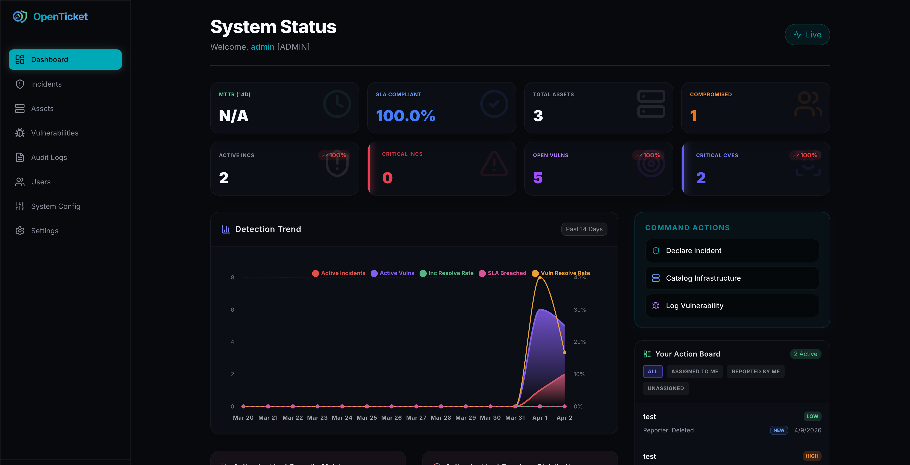

# OpenTicket (Beta)

<p align="center">
  
</p>
<p align="center">
  
</p>

[🌐 Read in English](../README.md) | [🏗️ 架構設計書 (Architecture Specs)](docs/ARCHITECTURE.zh-TW.md)

專為資安維運 (SecOps) 與 IT 團隊打造的次世代資安事件與資產集中管理系統。作為 Jira 或 ServiceNow 等企業級 IT 工單系統的輕量化、視覺化替代方案而生。

## ✨ 核心特色
- **集中化儀表板：** 透過即時指標、事件拓樸分佈與嚴重性矩陣，全面掌控組織的曝險狀態。
- **事件與漏洞雙軌追蹤：** 具備端對端的事件分流管道，能將複雜的資安事件與 CVE 漏洞直接映射到內部受害資產上。
- **雙因子驗證 (2FA) 安全機制：** 內建基於 TOTP 演算法的 2FA 模組，可完美整合各種標準驗證器應用程式 (如 Google Authenticator, Authy)。更支援系統管理員「一鍵強制全域啟用 2FA」的鎖定功能。
- **高密度 SOC 配置 (High-Density Layout)：** 重新設計的單行 8 指標 KPI 網格，讓維運人員能一眼看清資安戰場全貌，並將重點應變面板 (Command Actions) 移至上方，極速縮短反應遲滯時間。
- **陣列化多角色存取控制 (Multi-Role RBAC)：** 原生的多層次權限隔離機制，支援同時為特定維運人員疊加 `ADMIN` (全域基建覆蓋), `SECOPS` (事件處置), `REPORTER` (通報) 與 `API_ACCESS` (開放機器介接) 等複數權限標籤，帶來極大的組織架構彈性。
- **可插拔的擴展架構 (Plug-and-Play Architecture)：** 具備獨立的資料庫 Hook Engine (事件總線)，所有延伸功能與第三方依賴皆被收斂至 Settings -> Plugins 進行熱插拔與設定，不再讓 Dashboard 塞滿複雜無關的配置。
- **全方位硬派通知中心 (Omni-channel Notifications)：** 原生支援基於 SMTP 的事件與註冊身份驗證，並提供能夠根據危險等級 (Critical, High) 自訂過濾，且直接推播至桌面作業系統的 HTML5 Web Notifications 背景通知機制。
- **企業級現代介面 (Enterprise UI)：** 以 TailwindCSS 打造高質感 Blur / Backdrop-filter 動態特效，結合深度互動的 Shadcn 元件、透過 Portal 防裁切與支援手動輸入的客製化 `react-datepicker`，以及視覺化的 Recharts 圖表庫。

---

## 🚀 應用範例與使用情境 (Examples & Usage)

### 1. 通報資安事件 (Declaring an Incident)
當一位 `REPORTER` 或 `SECOPS` 發現潛在威脅時：
- 在主控台點擊 **"Declare Incident (通報事件)"**。
- 輸入事件特徵 (舉例：*Port 443 發現可疑的外部連線流量*)。
- 選擇與該威脅相關聯的 **Target Node (事件標的資產)** (舉例：*SRV-WEB-01*)。 
- 指定相對應的 **事件拓樸 (Typology)** (舉例：*釣魚信件 Phishing, 惡意軟體 Malware, 網路異常 Network Anomaly*)。

### 2. 登錄與追蹤系統漏洞 (Triaging Vulnerabilities)
漏洞追蹤模組直接鏡像了系統的資產庫：
- 前往 **"Log Vulnerability (登錄漏洞)"**。
- 輸入該漏洞正式的 `CVE-ID` 以便立案，並選定其 CVSS 嚴重程度。
- 將該漏洞指派給具體的系統節點 (Asset)。送出後，主控台的 *Vulnerability Heatmap (漏洞嚴重性熱圖)* 會立刻動態更新。

### 3. 機器自動化介接 (Machine-to-Machine API Tokens)
您可以將 OpenTicket 直接與 CI/CD 管道或企業內部的 SOAR 自動化劇本串接。
- 前往 **"Identity Preferences (身分設定) -> API Tokens"** (帳戶需具備 `API_ACCESS` 或 `ADMIN` 標籤)。
- 生成一組受密碼學保護的自動化金鑰 (例如命名為：*GitHub Actions Push*)。
- 在外部腳本呼叫 `/api/incidents` 或 `/api/assets` 端點時，將其帶入 Header：`Authorization: Bearer <token>`。該呼叫將自動繼承生成該金鑰者的既有伺服器權限。

### 4. 啟用系統擴充外掛 (Activating System Plugins)
全域管理者可至 `Plugins` 頁面無縫介入核心事件攔截網：
- 系統原生存有一套高度優化的 **Slack Critical Notifier**，是一套完全去耦 (Decoupled) 的先導展示外掛。
- 您可以在 Plugin Store 中一鍵「安裝」，於彈出的模組化設定視窗中貼上您的 Webhook URL。設定完畢後，所有系統中被建立的極端資安事件皆會在不阻塞核心行程的情況下，於毫秒級被推送至您的指定頻道。

---

## 🛠️ 核心技術堆疊
- **框架：** Next.js 16.2 (使用 App Router 與 Server Actions 架構)
- **資料庫：** PostgreSQL (透過 Prisma ORM V6 驅動)
- **身份驗證：** Auth.js v5 (NextAuth.js) / bcrypt / OTPAuth
- **樣式與核心元件：** TailwindCSS v4, Lucide React, Shadcn/UI, React-Datepicker (支援客製化自動防呆補全)
- **資料視覺化：** Recharts v3
- **安全掃描供應鏈：** Snyk

---

## 🚀 快速啟動 (安裝說明)

OpenTicket 提供了兩種無痛部屬平台的方式：**完全容器化** (建議用於生產環境) 或是**快速啟動腳本** (建議用於本地開發)。

### 選項 A: 完全容器化部署 (Docker 企業方案)
這是運行 OpenTicket 最簡單的方式，透過 Docker Compose 將會自動為您配置最新的 PostgreSQL 資料庫、執行關聯遷移，並啟動極度最佳化的 Next.js 獨立容器 (Standalone)。

```bash
docker-compose up -d
```
*您的應用程式將會啟動在 `http://localhost:3000`。任何時候都可以透過 `docker-compose down` 來將其關閉。*

### 選項 B: 本地開發腳本 (Bare-Metal)
如果您偏好直接在本地主機執行 Node.js，只需執行這隻啟動腳本。它會以互動式的方式為您配對 `.env` 環境變數、安裝依賴套件並執行 Prisma 遷移。

```bash
# 請確保您的本機已經有空的 PostgreSQL 實例在運行
chmod +x setup.sh
./setup.sh

# 啟動開發伺服器
npm run dev
```

### 🪄 首次啟動引導精靈
無論您選擇上述哪一種部屬方式，當您首次進入 `http://localhost:3000` 時，系統會自動將您重新導向至**系統初始化精靈 (`/setup`)**。這將引導您安全地註冊全系統第一位最高權限管理員 (Global System Administrator)。
