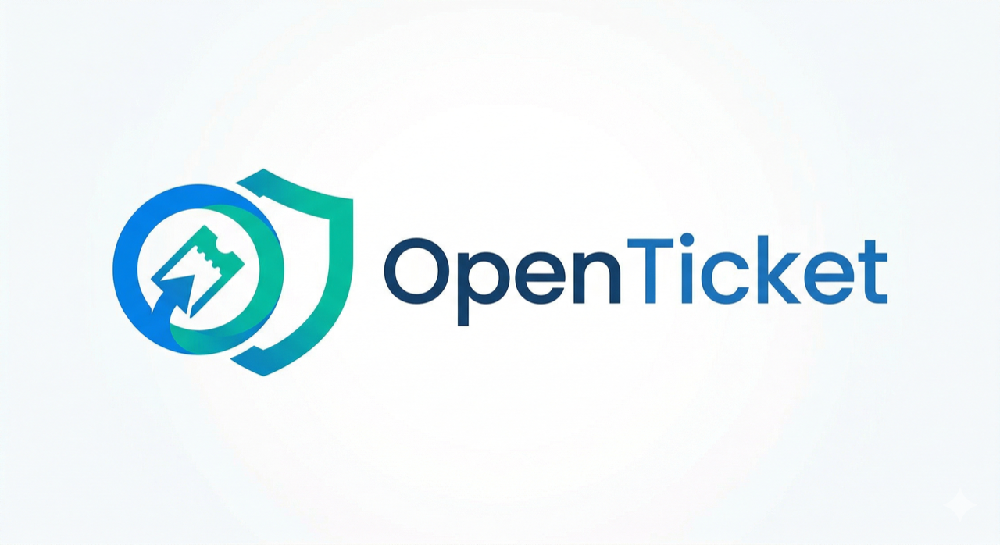

# OpenTicket (Beta)

<p align="center">
  
</p>

[🌍 官方文件網站 (Official Webpage)](https://openticket.cyber-sec.space) | [🌐 Read in English](README.md) | [🏗️ 架構設計書 (Architecture Specs)](docs/ARCHITECTURE.zh-TW.md) | [🔌 外掛註冊庫 (Plugin Registry)](https://github.com/Cyber-Sec-Space/openticket-plugin-registry)

專為資安維運 (SecOps) 與 IT 團隊打造的次世代資安事件與資產集中管理系統。作為 Jira 或 ServiceNow 等企業級 IT 工單系統的輕量化、視覺化替代方案而生。

## ✨ 核心特色
- **絕對邊界零信任防禦 (L7 DDoS Defense)：** 全部的 API 負載皆受到 Next.js Edge Middleware (`proxy.ts`) 的主動攔截保護。完全杜絕未授權的巨量探測流量實體接觸後端 Node.js 執行緒池與 PostgreSQL 資料庫。
- **免疫 DNS Rebinding 與 SSRF 阻擊：** 透過「解析截斷」徹底粉碎 Time-of-Check Time-of-Use (TOCTOU) 攻擊的伺服器請求偽造，系統在派發 Webhook 前會完全凍結安全的 IPv4 動態位址，保護您內網的 VPC 空白地帶不被穿透。
- **針對性機器人阻禦 (分離式限流機制)：** 採用嚴格的 In-Memory 評估，並將 IP 探測頻率與針對固定 Identifier 的帳號撞庫攻擊「去耦合 (Decouple)」，完美瓦解分散式殭屍網路。
- **Postgres 原生全文檢索 (tsvector)：** 捨棄了效能災難的傳統 `O(N)` 模糊比對查詢，採用 Postgres 內建的 `tsquery` 索引結構，使得超大型資料庫的事件儀表板與日誌搜尋仍能保持毫秒級流暢回傳。
- **全非同步的對話框介面 (Async Dialog UX)：** 拔除會造成系統阻塞的原生警告視窗，全面重構為 React Portaled `<Dialog>`，實現無縫單頁式的高流暢維運體驗。
- **集中化儀表板：** 透過即時指標、事件拓樸分佈與嚴重性矩陣，全面掌控組織的曝險狀態。
- **事件與漏洞雙軌追蹤：** 具備端對端的事件分流管道，能將複雜的資安事件與 CVE 漏洞直接映射到內部受害資產上。
- **雙因子驗證 (2FA) 安全機制：** 內建基於 TOTP 演算法的 2FA 模組，可完美整合各種標準驗證器應用程式 (如 Google Authenticator, Authy)。更支援系統管理員「一鍵強制全域啟用 2FA」的鎖定功能。
- **高密度 SOC 配置 (High-Density Layout)：** 重新設計的單行 8 指標 KPI 網格，讓維運人員能一眼看清資安戰場全貌，並將重點應變面板 (Command Actions) 移至上方，極速縮短反應遲滯時間。
- **企業級高可用性 (Enterprise High-Availability)：** 原生內建 `PgBouncer` Sidecar 微服務拓撲並強制執行交易連線池 (Transactional Connection Pooling)。這徹底根除了多節點水平擴展時可能發生的資源飢餓，確保在負載平衡器運作下仍具備極致的併發資料庫吞吐量。
- **零信任機器識別 (Zero-Trust M2M Identities)：** 強制將自動化 API 互動操作與人類管理員角色徹底解耦。系統會自動為 API Tokens 劃定獨立的 `Automation Bot (M2M)` 取用邊界，確保即便 CI/CD 腳本遭駭，以 Token 為基底的驗證也絕對無法繼承或擴權至任意的使用者後台層級控制權。
- **動態細粒度權限矩陣 (Dynamic Granular Permission Matrix)：** 原生的進階 RBAC 權限隔離機制，管理員能夠自由定義「自訂角色 (Custom Roles)」，並精細配置各項原子操作權限 (如 `CREATE_INCIDENTS`, `VIEW_ASSETS`, `INSTALL_PLUGINS`)。人員能同時疊加複數自訂角色權限標籤，為巨型 SOC 環境帶來零信任 (Zero-Trust) 的極大組織架構彈性。
- **零信任沙盒與外掛生態 (Zero-Trust EventBus & Plugins)：** 具備堅若磐石的背景 EventBus。外部的第三方外掛會被原生的五道隔離防線死死鎖進沙盒中，包含：Promise `Time-Bomb` 執行時限炸彈 (5000ms)、`Thundering Herd` 快取防雪崩機制、以及配置資料庫的 `端對端 AES-256-GCM` 靜態加密。管理員除了能透過沉浸式的 UI 授權畫面進行底層權限交集審核外，外掛現在更能合法透過 `settingsPanels` 擴充原生的前端介面能力，並在安裝前會受到**強制的 AST 語法預防機制 (Pre-flight AST Validation)** 阻攔，徹底防堵任何惡意代碼污染底層的機會。
- **高解析外掛 UI 擴充 (Granular Plugin Extensibility)：** 釋出外科手術般精準的 UI Hook 攔截點（如 `*MainWidgets` 與 `*SidebarWidgets`），讓外部外掛能夠無縫地將特殊顯示卡片與控制套件，嚴格注入至事件 (Incident)、漏洞 (Vulnerability)、資產 (Asset) 或使用者面板的「主時間軸」或「次要資料側邊欄」內，且絕不會破壞基礎的排版完整性。
- **全方位通知中心 (Omni-channel Notifications)：** 原生支援藉由可配置的 SMTP 設定發送 Email（適用於驗證與密碼重置），同時具備基於「伺服器發送事件 (SSE, Server-Sent Events)」的高效能 HTML5 桌面推播通知中心，持續在背景過濾並提醒重大資安威脅。
- **資安優先防禦 (Security-First Paradigm)：** 針對認證管道實施 in-memory 防暴力破解 (Brute Force Rate Limiting) 壓制撞庫攻擊；並且在事件評論與關鍵操作上導入無死角的越權存取防禦 (BOLA, Broken Object Level Authorization) 阻攔未授權編輯。
- **雙軌授權透明化 (Transparent Dual-Licensing)：** 將 AGPL-3.0 與 Enterprise (企業版) 的雙軌授權模式徹底融入應用程式介面中，協助企業級客戶維持嚴謹的開源軟體授權合規性 (Licensing Hygiene)。
- **多版本協議解耦 (Multi-Version Protocol)：** 將 OpenTicket 平台主版號與底層的 Plugin SDK 沙盒引擎版號 (`PLUGIN_API_VERSION`) 正式脫鉤。允許第三方外掛精準標示其依賴的 Hook Engine 核心版本，達成完美的向後相容。
- **企業級現代介面 (Enterprise UI)：** 以 TailwindCSS 打造高質感 Blur / Backdrop-filter 動態特效，結合深度互動的 Shadcn 元件、透過 Portal 防裁切與支援手動輸入的客製化 `react-datepicker`，以及視覺化的 Recharts 圖表庫。

<!-- IMAGE PLACEHOLDER: [OpenTicket Dashboard / Threat Matrix Preview] -->

---

## 🚀 應用範例與使用情境 (Examples & Usage)

### 1. 通報資安事件 (Declaring an Incident)
當一位具備 `CREATE_INCIDENTS` 權限的維運人員發現潛在威脅時：
- 在主控台點擊 **"Declare Incident (通報事件)"**。
- 輸入事件特徵 (舉例：*Port 443 發現可疑的外部連線流量*)。
- 選擇與該威脅相關聯的 **Target Node (事件標的資產)** (舉例：*SRV-WEB-01*)。 
- 指定相對應的 **事件拓樸 (Typology)** (舉例：*釣魚信件 Phishing, 惡意軟體 Malware, 網路異常 Network Anomaly*)。

### 2. 登錄與追蹤系統漏洞 (Triaging Vulnerabilities)
漏洞追蹤模組直接鏡像了系統的資產庫：
- 前往 **"Log Vulnerability (登錄漏洞)"**。
- 輸入該漏洞正式的 `CVE-ID` 以便立案，並選定其 CVSS 嚴重程度。
- 將該漏洞指派給具體的系統節點 (Asset)。送出後，主控台的 *Vulnerability Heatmap (漏洞嚴重性熱圖)* 會立刻動態更新。

### 3. 機器自動化介接 (Machine-to-Machine API Tokens)
您可以將 OpenTicket 直接與 CI/CD 管道或企業內部的 SOAR 自動化劇本串接。
- 前往 **"Identity Preferences (身分設定) -> API Tokens"** (帳戶需具備 `ISSUE_API_TOKENS` 高權限標籤)。
- 生成一組受密碼學保護的自動化金鑰 (例如命名為：*GitHub Actions Push*)。
- 在外部腳本呼叫 `/api/incidents` 或 `/api/assets` 端點時，將其帶入 Header：`Authorization: Bearer <token>`。該呼叫將自動繼承生成該金鑰者的既有伺服器權限。

### API 與系統整合
- **零信任 Hook 引擎 (Zero-Trust Hook Engine)**：非同步的事件總線架構 (`onIncidentCreated`, `onAssetCompromise`, `onIncidentResolved`)，能在背景安全執行外部程式碼，並受到強大的 5秒 `Promise.race` 沙盒保護，完全免疫阻斷服務 (DoS) 攻擊。
- **外部沙盒外掛編排 (External Plugin Sandbox Orchestration)**：直接透過 UI 驅動的外掛市集，一鍵橋接 Jira 雙向同步、外部 SOC 監聽器或 Slack/Teams Webhooks。所有外掛都會強制進入伺服器級的「權限交集審查 (Manifest Intersections)」，必須由管理員手動核准其最小運行權限。
- **加固 M2M 機器金鑰 (Secure M2M Key Cryptography)**：面對資料庫洩露具備絕對抗性。除了傳統的機器介接金鑰採用不可逆雜湊，所有的第三方整合參數庫皆會透過 `AES-256-GCM` 加密封裝至保險庫中。
- **登入限流與撞庫防禦 (Brute Force & Rate Limiting)**：透過後台對存取源的精準頻率限制，防止分散式密碼噴灑 (Password Spraying) 耗盡您的核心伺服器資源。

---

## 🛠️ 核心技術堆疊
- **框架：** Next.js 16.2 (使用 App Router 與 Server Actions 架構)
- **資料庫：** PostgreSQL (透過 Prisma ORM V6 驅動)
- **身份驗證：** Auth.js v5 (NextAuth.js) / bcrypt / OTPAuth
- **樣式與核心元件：** TailwindCSS v4, Lucide React, Shadcn/UI, React-Datepicker (支援客製化自動防呆補全)
- **資料視覺化：** Recharts v3
- **安全掃描供應鏈：** Snyk

---

## 🚀 快速啟動 (安裝說明)

OpenTicket 提供了兩種無痛部屬平台的方式：**完全容器化** (建議用於生產環境) 或是**快速啟動腳本** (建議用於本地開發)。

### 選項 A: 完全容器化部署 (Docker 企業方案)
這是運行 OpenTicket 最簡單的方式，透過 Docker Compose 將會自動為您配置最新的 PostgreSQL 資料庫、非同步調度獨立的 Migrator 遷移管線、掛載 PgBouncer 連線池，並啟動極度最佳化的 Next.js 獨立容器 (Standalone)。

```bash
# 確保您已經先從安全範本複製了生產生態設定
cp .env.example .env

docker-compose up -d --build
```
*您的應用程式將會啟動在 `http://localhost:3000`。任何時候都可以透過 `docker-compose down` 來將其關閉。*

### 選項 B: 本地開發腳本 (Bare-Metal)
如果您偏好直接在本地主機執行 Node.js，只需執行這隻啟動腳本。它會以互動式的方式為您配對 `.env` 環境變數、安裝依賴套件並執行 Prisma 遷移。

```bash
# 請確保您的本機已經有空的 PostgreSQL 實例在運行
chmod +x setup.sh
./setup.sh

# 啟動開發伺服器
npm run dev
```

### 選項 C: 預編譯 Standalone 獨立包 (生產環境 / 極簡部屬)
對於內部受限無法使用 Docker，但仍需要極度最佳化生產環境部屬的網路，OpenTicket 在 [GitHub Releases](https://github.com/Cyber-Sec-Space/open-ticket/releases) 區塊提供了預先編譯好的 Standalone 獨立封裝包。
這個 `.tar.gz` 壓縮包內含了 Next.js 編譯並優化後的 `.next/standalone` 輸出庫，您完全不需要在正式環境手動執行耗時的 `npm install`。

```bash
# 1. 從 GitHub Releases 下載 Standalone 獨立壓縮包
wget https://github.com/Cyber-Sec-Space/open-ticket/releases/download/v0.5.2/openticket-standalone-v0.5.2.tar.gz

# (可選步驟) 驗證下載檔案的完整性 (SHA-512)
# 預期輸出: (SHA-512 Hash 將在建置管線佈署後正式公佈)
shasum -a 512 openticket-standalone-v0.5.2.tar.gz

# 解壓縮
tar -xzf openticket-standalone-v0.5.2.tar.gz
cd openticket-standalone

# 2. 設定您的環境變數 (.env)
cp .env.example .env
nano .env # 請務必設定好獨立的 DATABASE_URL 與 NEXTAUTH_SECRET

# 3. 對您準備好的 PostgreSQL 資料庫執行架構遷移
npx prisma migrate deploy

# 4. 原生啟動 Node.js 生產端伺服器進程
node server.js
```

### ⬆️ 跨代版本無痛升級 (0.3.0 -> 0.5.0)
版本 0.5.0 徹底補強了龐大的 **零信任外掛架構 (Plugin SDK)** 與 **PgBouncer** 基礎設施，這些都是建築在 0.4.0 的 RBAC 改朝換代之上。
為避免跨代升級時 PostgreSQL 直刷 SQL 造成的永久性欄位丟失，OpenTicket 在底層實作了向後相容的冪等 (Idempotent) 防護。

若您使用的是 Docker 環境，當您下達 `docker-compose up` 啟動時，內部的 `migrate:prod` 鍊式腳本會自動幫您搞定這些相依轉換。
但如果您是裸機 (Bare-Metal) 安裝者，請您**務必**手動執行專屬的無損升級腳本，它會確保舊設定在被砍除前先安全映射：

```bash
# 攔截並提取舊版系統管理員權限，安全部屬 Schema，然後精準灌入最新的外掛層權限
npm run migrate:prod
```

### 🪄 首次啟動引導精靈
無論您選擇上述哪一種部屬方式，當您首次進入 `http://localhost:3000` 時，系統會自動將您重新導向至**系統初始化精靈 (`/setup`)**。這將引導您安全地註冊全系統第一位最高權限管理員 (Global System Administrator)。
