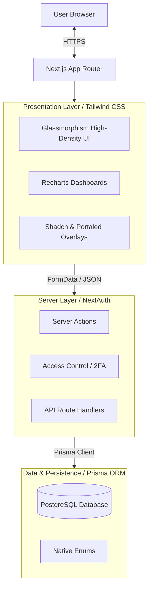
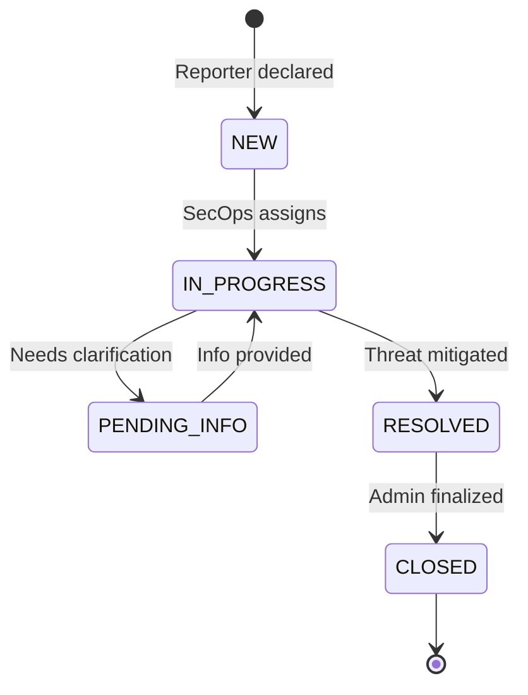
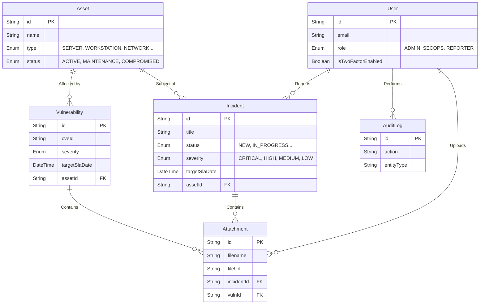

# OpenTicket Architecture

A centralized approach to cybersecurity incident & inventory management emphasizing simplicity, accountability, and speed. Built via an end-to-end monolithic architecture leveraging Server Functions for secure and fast data transmission.

[🌐 Read in Traditional Chinese (繁體中文)](ARCHITECTURE.zh-TW.md)

---

## 1. High-Level Architecture Diagram
The platform is built on Next.js 15 (App Router framework). To ensure strict component integrity and avoid hydration mismatch errors on complex dynamic selections, we utilize specialized data resolution closures alongside Radix/BaseUI.

---

## 2. Platform Modules & Workflows

### 2.1 Incident Management Lifecycle
The primary functionality revolves around tracking incidents directly mapped to organizational infrastructure.

### 2.2 Relational Structure (ERD)
The database schema utilizes strict referential integrity. All significant changes (both incidents and asset relationships) invoke the Audit Log component to preserve non-repudiation.

---

## 3. Key Technical Decisions (ADR)

* **Server Actions over REST:** Most internal state mutations leverage React Server Actions (`"use server"`) directly accepting `FormData`. This cuts out the `fetch/axios` boilerplate and handles backend validations instantly.
* **Component-Level Enums & Database Enums:** Prisma stringifies the values differently across layers. The database enforces constraints (`IN_PROGRESS`), while the Application rendering layer strips special characters (e.g. `IN PROGRESS`) to present unified UI strings, re-injecting them contextually inside Server Actions.
* **Security at Inception:** 
   - We enforce zero configuration default secure cookies using `Auth.js`.
   - Replaced weak pseudo-random generation dependencies (`bcryptjs`) with compiled implementations (`bcrypt`).
   - A global `SystemSetting` toggle can immediately quarantine non-2FA-compliant accounts from performing critical system actions (`Global2FAEnforcedError`).
* **Z-Index & Overflow Hierarchy Management:** In order to achieve a high-density, centralized dashboard, complex CSS boundaries like `overflow-hidden` are used heavily in Glassmorphism cards. To circumvent these hard structural constraints causing dropdowns and third-party overlays (e.g. `react-datepicker`) to be truncated, we aggressively utilize React Portals (`portalId`) and manual Z-Index elevation to ensure overlays mount dynamically outside the standard React DOM encapsulation tree.
