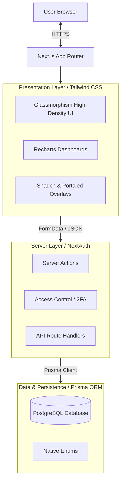
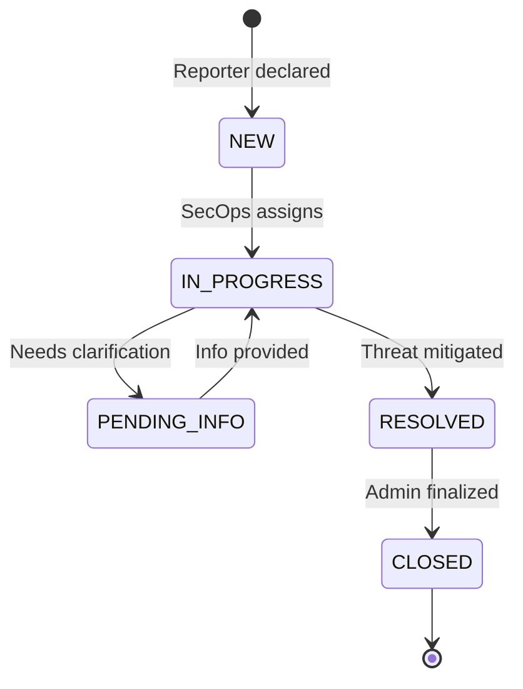
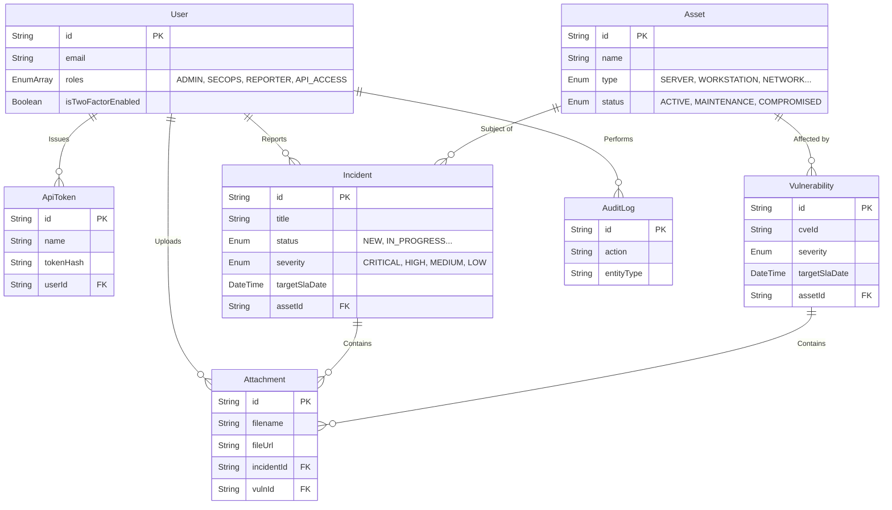
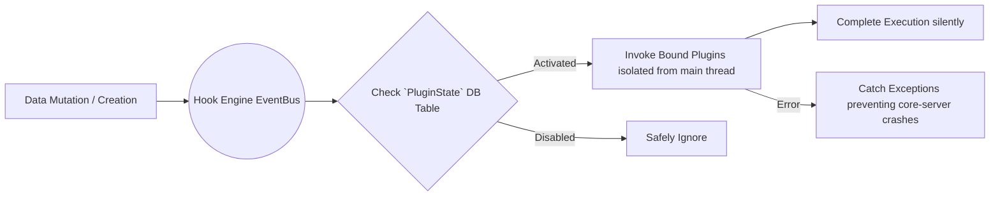
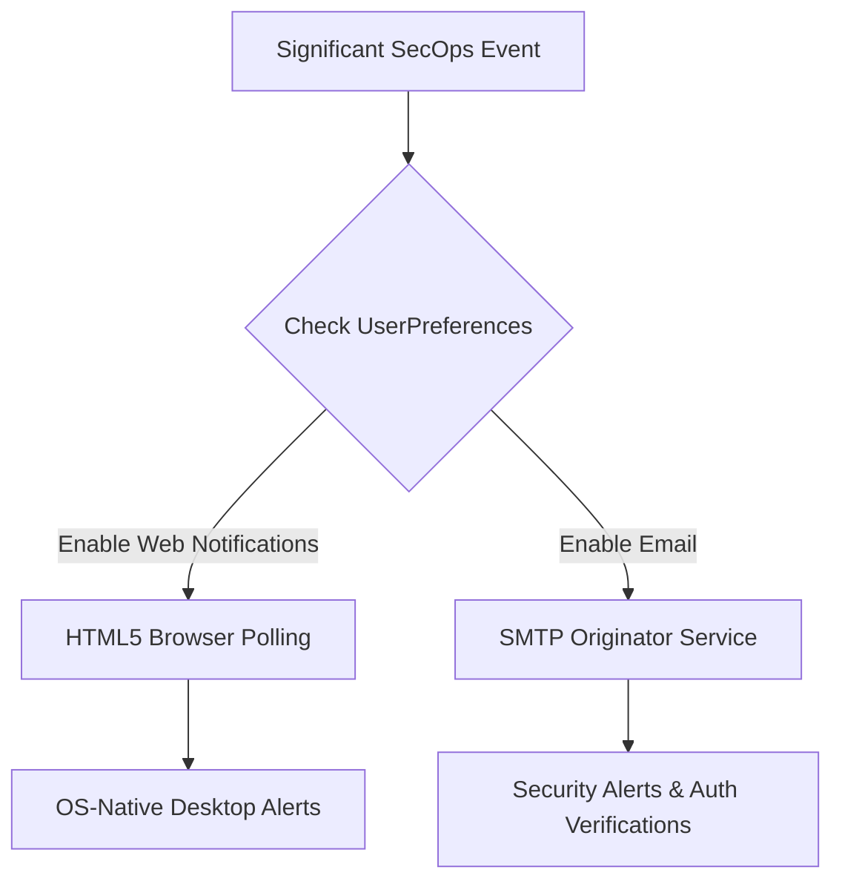

# OpenTicket Architecture

A centralized approach to cybersecurity incident & inventory management emphasizing simplicity, accountability, and speed. Built via an end-to-end monolithic architecture leveraging Server Functions for secure and fast data transmission.

[🌐 Read in Traditional Chinese (繁體中文)](ARCHITECTURE.zh-TW.md)

---

## 1. High-Level Architecture Diagram
The platform is built on Next.js 15 (App Router framework). To ensure strict component integrity and avoid hydration mismatch errors on complex dynamic selections, we utilize specialized data resolution closures alongside Radix/BaseUI.

---

## 2. Platform Modules & Workflows

### 2.1 Incident Management Lifecycle
The primary functionality revolves around tracking incidents directly mapped to organizational infrastructure.

### 2.2 Relational Structure (ERD)
The database schema utilizes strict referential integrity. All significant changes (both incidents and asset relationships) invoke the Audit Log component to preserve non-repudiation.

### 2.3 Machine-to-Machine API Integration
The system natively supports headless execution directly through the primary data routes (`/api/incidents`, `/api/assets`). To preserve strict isolation and identity propagation, integrations authenticate using cryptographic tokens passed via the `Authorization: Bearer <token>` header. These tokens are generated by authorized accounts and directly inherit their creator's privilege tiers (Array-based Multi-Role control).

### 2.4 Plugin Architecture & EventBus
To avoid blocking the primary web threads with complex external third-party actions (e.g. Slack Webhooks, Teams, Jira syncing), the system utilizes a lightweight **Hook Engine**. All major operations trigger the EventBus, which defers to the PostgreSQL `PluginState` table to conditionally invoke modular third-party code in the background.

### 2.5 Omni-channel Notifications
Administrators can broadcast critical telemetry across multiple communication layers, governed seamlessly by discrete `UserPreference` records.

---

## 3. Key Technical Decisions (ADR)

* **Server Actions over REST:** Most internal state mutations leverage React Server Actions (`"use server"`) directly accepting `FormData`. This cuts out the `fetch/axios` boilerplate and handles backend validations instantly.
* **Array-Based Multi-Role Constraints (RBAC):** Instead of boolean matrices or multiple disconnected boolean fields (e.g., `isAdmin`, `isSecops`), we natively support arrays within PostgreSQL naturally mapped by Prisma. This enables overlapping administrative structures (e.g., [`SECOPS`, `API_ACCESS`]) without DB migrations when new access tiers expand.
* **API Token Cryptography:** The database explicitly refuses to store raw `ApiToken` identities. When an integration mints keys, OpenTicket invokes `crypto.randomBytes(24)` to mint a 48-character Hex payload, and unilaterally stores a one-way `SHA-256` hash. Subsequent REST invocations compare hashes safely to prevent exposure during compromise.
* **Component-Level Enums & Database Enums:** Prisma stringifies the values differently across layers. The database enforces constraints (`IN_PROGRESS`), while the Application rendering layer strips special characters (e.g. `IN PROGRESS`) to present unified UI strings, re-injecting them contextually inside Server Actions.
* **Security at Inception:** 
   - We enforce zero configuration default secure cookies using `Auth.js`.
   - Replaced weak pseudo-random generation dependencies (`bcryptjs`) with compiled implementations (`bcrypt`).
   - A global `SystemSetting` toggle can immediately quarantine non-2FA-compliant accounts from performing critical system actions (`Global2FAEnforcedError`).
* **Z-Index & Overflow Hierarchy Management:** In order to achieve a high-density, centralized dashboard, complex CSS boundaries like `overflow-hidden` are used heavily in Glassmorphism cards. To circumvent these hard structural constraints causing dropdowns and third-party overlays (e.g. `react-datepicker`) to be truncated, we aggressively utilize React Portals (`portalId`) and manual Z-Index elevation to ensure overlays mount dynamically outside the standard React DOM encapsulation tree.
