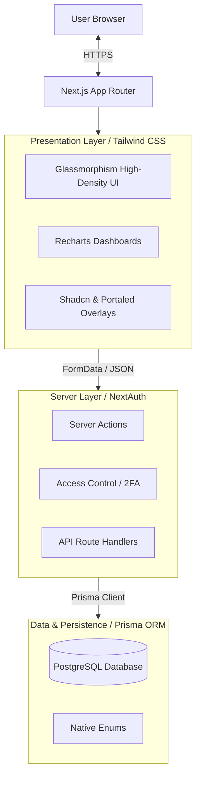
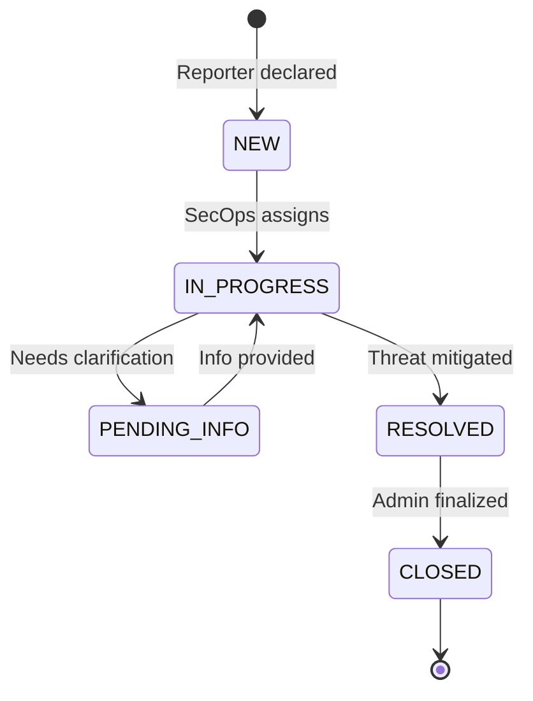
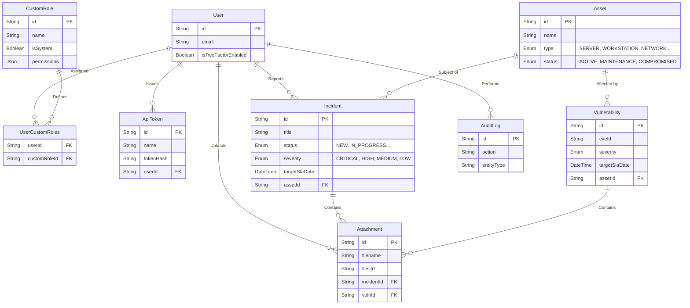
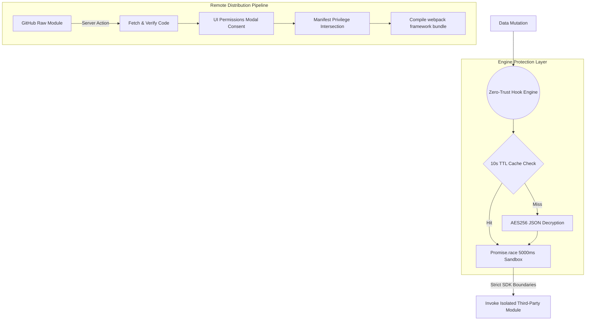
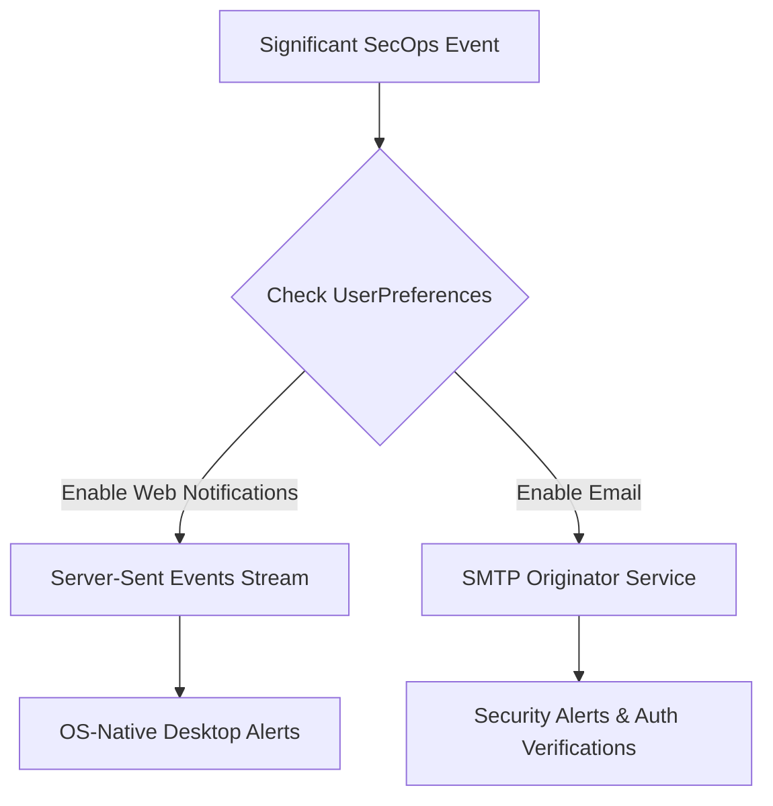
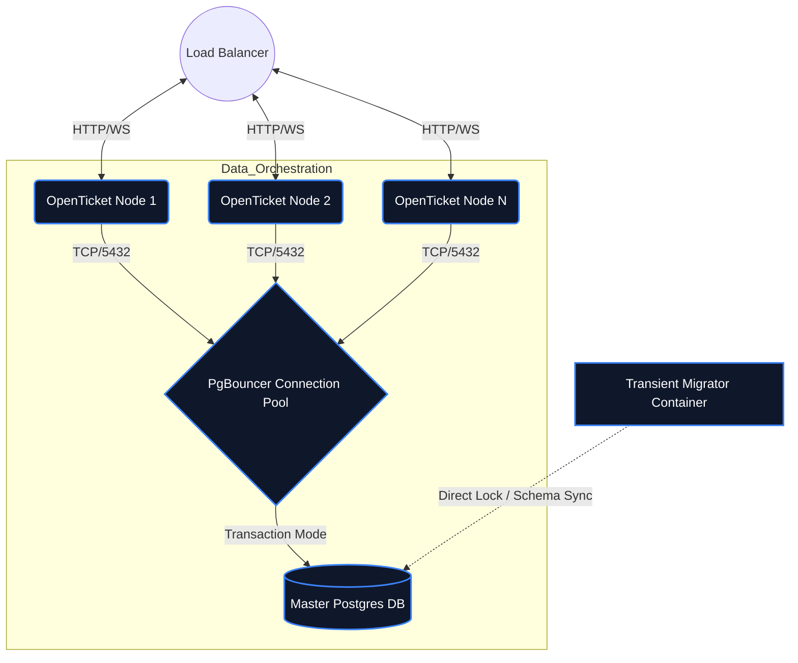

# OpenTicket Architecture

A centralized approach to cybersecurity incident & inventory management emphasizing simplicity, accountability, and speed. Built via an end-to-end monolithic architecture leveraging Server Functions for secure and fast data transmission.

[🌐 Read in Traditional Chinese (繁體中文)](ARCHITECTURE.zh-TW.md)

---

## 1. High-Level Architecture Diagram
The platform is built on Next.js 15 (App Router framework). To ensure strict component integrity and avoid hydration mismatch errors on complex dynamic selections, we utilize specialized data resolution closures alongside Radix/BaseUI.

---

## 2. Platform Modules & Workflows

### 2.1 Incident Management Lifecycle
The primary functionality revolves around tracking incidents directly mapped to organizational infrastructure.

### 2.2 Relational Structure (ERD)
The database schema utilizes strict referential integrity. All significant changes (both incidents and asset relationships) invoke the Audit Log component to preserve non-repudiation.

### 2.3 Machine-to-Machine API Integration
The system natively supports headless execution directly through the primary data routes (`/api/incidents`, `/api/assets`). To preserve strict isolation and identity propagation, integrations authenticate using cryptographic tokens passed via the `Authorization: Bearer <token>` header. These tokens are generated by authorized accounts and directly inherit their creator's strict database privilege tiers (Granular Permission Matrix).

### 2.4 Hybrid Plugin Architecture & EventBus (Hardened Sandbox)
To avoid blocking the primary web threads with complex external third-party actions (e.g. Slack Webhooks, Teams, Jira syncing), the system utilizes a **Zero-Trust Hook Engine** event bus. All major execution pipelines trigger the internal EventBus, which defers to the PostgreSQL `PluginState` to seamlessly broadcast asynchronous Webhooks.

### Native Plugin Isolation Strategies
1. **API Limit Sandbox**: Hook executions are bound directly to a `Promise.race()` primitive throwing an exception unconditionally at `5000ms`. Infinite loops or hanging API calls strictly collapse before threatening system responsiveness.
2. **End-to-End Cryptography**: Plugin parameters containing valid API tokens are protected against Database Dumps natively. Data is strictly ciphered using an `AES-256-GCM` implementation tied to Server Entropy before committing state.
3. **OAuth-Style Privilege Consent**: During installation, remote Registry Extensions broadcast explicitly required `Permissions`. Global Administrators must grant permissions through a dual-layer UI gateway blocking arbitrary codebase authorizations.

The Plugin architecture is built around a defense-in-depth framework spanning five core resilience layers:
1. **Absolute Identity Gating**: Plugins interact with the system via a limited `api.createIncident()` SDK abstraction. Every request is forced downstream via a provisioned Sandbox Bot Role.
2. **Authorization Manifests (OAuth-Style)**: Core integrations explicitly request operational permissions inside their root `manifest`. These are challenged inside the React Presentation layer necessitating explicit Administrative `Grant & Activate` user decisions. Backends execute strict Set-Intersections, purging any unsanctioned permissions stealthily invoked during `onInstall`.
3. **Encryption At Rest**: To preserve the secrecy of Third-Party configurations (e.g. Webhook URLs, OAuth secrets), configuration payloads are automatically encrypted prior to rest via `AES-256-GCM` mapped against `NEXTAUTH_SECRET`, with an integral AuthTag neutralizing manipulation injections.
4. **Thundering Herd Eradication (TTL Caching)**: High-Frequency telemetry loops (10,000+ hook emissions / second) are cleanly isolated from PostgreSQL `SELECT` avalanching via a short-lived (10-second) Synchronous Context Cache map. DB queries resolve exactly once universally.
5. **Promise Time-Bomb Sandbox**: To thwart DoS loops or `Awaiting` starvation triggered by poorly-authored external API `fetch()` logic, native Event injections execute inside a bounded `Promise.race()` primitive, unilaterally severing integration pipelines after `5000ms`, shielding Node's single-threaded Loop.
6. **UI Component Injection**: Moving beyond isolated server boundaries, Registry Manifests can safely transport React definitions via the `settingsPanels` API, natively embedding Plugin-specific Administrative dashboards directly into the parent Application without breaching cross-origin execution limits.

### 2.5 Omni-channel Notifications
Administrators can broadcast critical telemetry across multiple communication layers, governed seamlessly by discrete `UserPreference` records.

### 2.6 Deployments & High-Availability
To natively process High-Availability requirements and burst traffic within horizontally scaled topologies (e.g. Docker Swarm / Kubernetes), OpenTicket decouples stateful execution paths via dedicated sidecar microservices.

**Key Execution Paradigms**:
1. **Migration Decoupling**: Application schemas and Data-upgrade scripts (`upgrade-to-0.5.0.ts`) execute completely isolated within a transient `migrator` container prior to Web-Node boots, eliminating catastrophic database corruption caused by parallel locking crashes.
2. **Connection Pooling**: `PgBouncer` is natively wrapped enforcing `Transaction` mode, efficiently routing generic React Server Action queries without overflowing the core database `max_connections` bounds dynamically.

---

## 3. Key Technical Decisions (ADR)

* **Server Actions over REST:** Most internal state mutations leverage React Server Actions (`"use server"`) directly accepting `FormData`. This cuts out the `fetch/axios` boilerplate and handles backend validations instantly.
* **Dynamic Granular Permission Matrix:** Instead of restrictive monolithic enums (e.g., `isAdmin`, `isSecops`), we natively support many-to-many custom roles linking dynamic `JSON` capability arrays within PostgreSQL. This enables fine-grained customizable administrative structures (e.g., granting `CREATE_INCIDENTS` without full system override) adapting universally to distinct SOC environments natively linked to `UserCustomRoles`.
* **API Token Cryptography:** The database explicitly refuses to store raw `ApiToken` identities. When an integration mints keys, OpenTicket invokes `crypto.randomBytes(24)` to mint a 48-character Hex payload, and unilaterally stores a one-way `SHA-256` hash. Subsequent REST invocations compare hashes safely to prevent exposure during compromise.
* **Component-Level Enums & Database Enums:** Prisma stringifies the values differently across layers. The database enforces constraints (`IN_PROGRESS`), while the Application rendering layer strips special characters (e.g. `IN PROGRESS`) to present unified UI strings, re-injecting them contextually inside Server Actions.
* **Security at Inception:** 
   - We enforce zero configuration default secure cookies using `Auth.js`.
   - Replaced weak pseudo-random generation dependencies (`bcryptjs`) with compiled implementations (`bcrypt`).
   - A global `SystemSetting` toggle can immediately quarantine non-2FA-compliant accounts from performing critical system actions (`Global2FAEnforcedError`).
   - **Brute Force Defense**: Embedded in-memory IP-agnostic rate limiting explicitly mapped onto Authentication pipelines to neutralize distributed credential stuffing.
   - **Strict BOLA Adherence**: Exhaustive Backend Ownership evaluations actively reject direct-object manipulation over comments and incidents overriding default trust constraints.
* **Z-Index & Overflow Hierarchy Management:** In order to achieve a high-density, centralized dashboard, complex CSS boundaries like `overflow-hidden` are used heavily in Glassmorphism cards. To circumvent these hard structural constraints causing dropdowns and third-party overlays (e.g. `react-datepicker`) to be truncated, we aggressively utilize React Portals (`portalId`) and manual Z-Index elevation to ensure overlays mount dynamically outside the standard React DOM encapsulation tree.
* **Server-Side Registry Orchestration**: External node application extensions can be downloaded asynchronously on-demand directly via Server Actions. To implement live-production functionality injections, OpenTicket initiates an independent child spawn `exec` to reconstruct identical `next build` topologies locally, and subsequently intercepts the lifecycle via `process.exit(0)` delegating high-availability restart capabilities uniquely back to standard Daemon Managers (Cluster/PM2).
