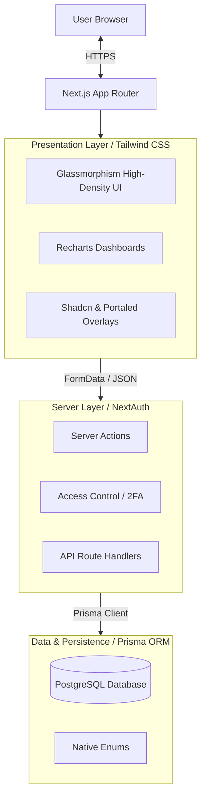
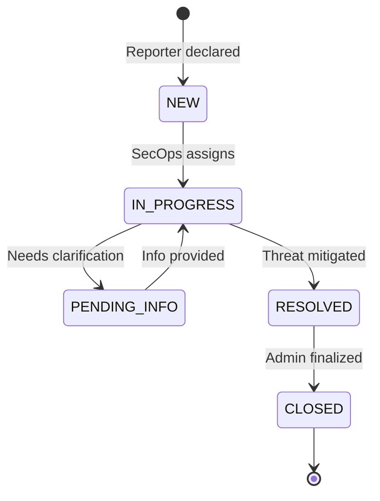
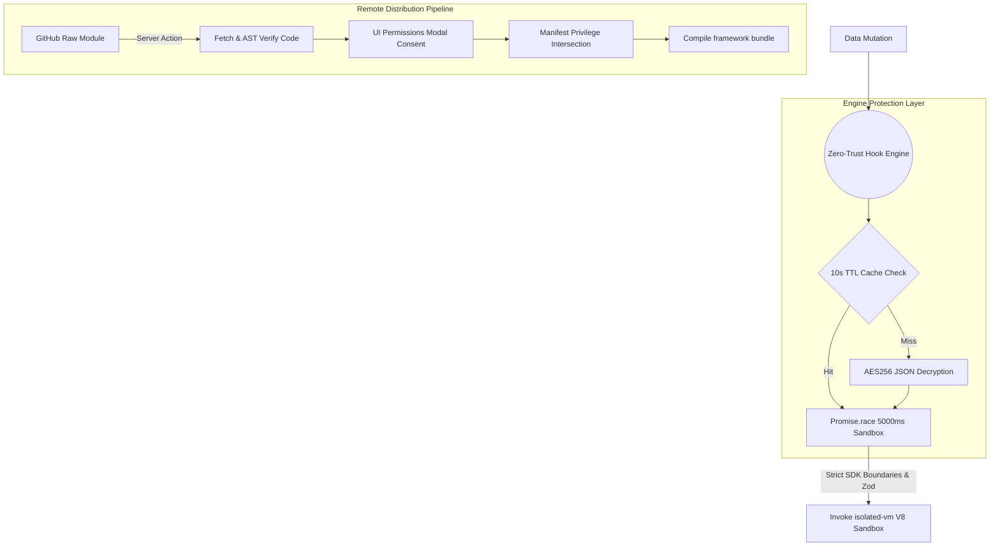
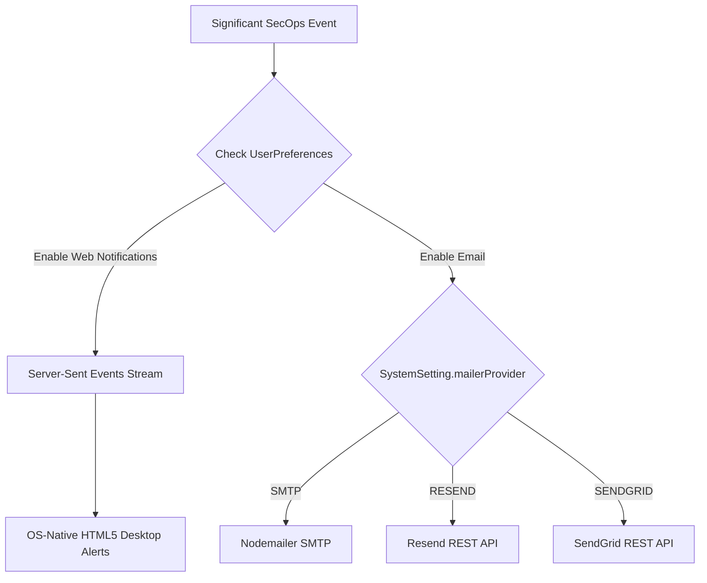
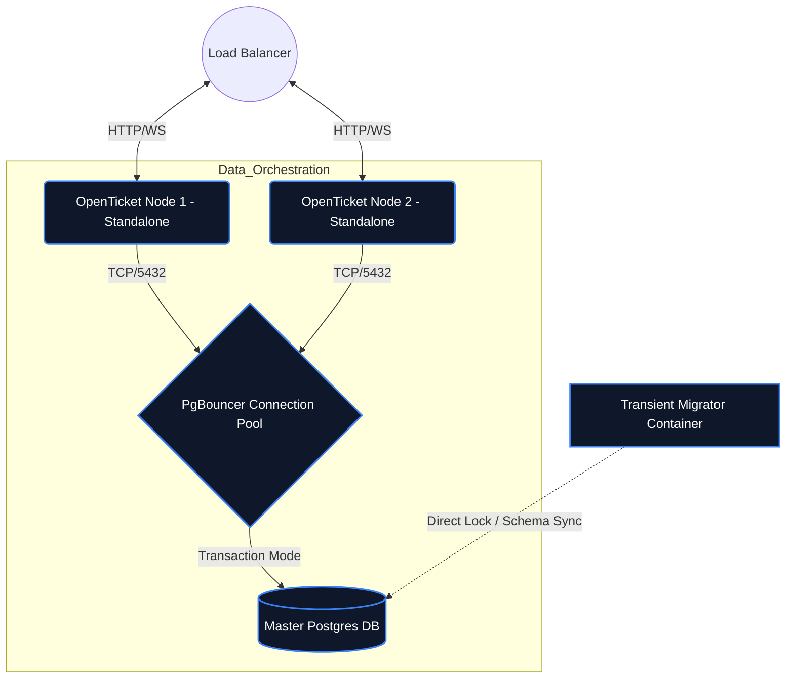
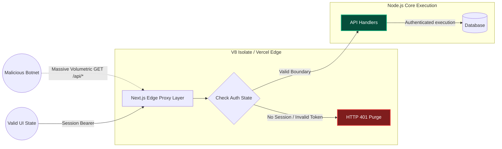

# OpenTicket Architecture

A centralized approach to cybersecurity incident & inventory management emphasizing simplicity, accountability, and speed. Built via an end-to-end monolithic architecture leveraging Server Functions for secure and fast data transmission.

[🌐 Read in Traditional Chinese (繁體中文)](ARCHITECTURE.zh-TW.md)

---

## 1. High-Level Architecture Diagram
The platform is built on Next.js 16.2 (App Router framework). To ensure strict component integrity and avoid hydration mismatch errors on complex dynamic selections, we utilize specialized data resolution closures alongside Radix/BaseUI and Shadcn/UI primitives.



---

## 2. Platform Modules & Workflows

### 2.1 Incident Management Lifecycle
The primary functionality revolves around tracking incidents directly mapped to organizational infrastructure.



### 2.2 Relational Structure (ERD)
The database schema utilizes strict referential integrity. All significant changes (both incidents and asset relationships) invoke the Audit Log component to preserve non-repudiation. System-wide configuration is maintained via a `SystemSetting` singleton entity.

```mermaid
erDiagram
    SystemSetting {
        String id PK
        Boolean smtpEnabled
        Enum mailerProvider
    }
    PluginState {
        String id PK
        Boolean isActive
        String configJson
    }
    User {
        String id PK
        String email
        Boolean isTwoFactorEnabled
        String twoFactorSecret
        Boolean notifyOnCritical
    }
    CustomRole {
        String id PK
        String name
        Boolean isSystem
        Json permissions
    }
    UserCustomRoles {
        String userId FK
        String customRoleId FK
    }
    ApiToken {
        String id PK
        String name
        String tokenHash
        String userId FK
    }
    Asset {
        String id PK
        String name
        Enum type "SERVER, WORKSTATION, NETWORK..."
        Enum status "ACTIVE, MAINTENANCE, COMPROMISED"
    }
    Incident {
        String id PK
        String title
        Enum status "NEW, IN_PROGRESS..."
        Enum severity "CRITICAL, HIGH, MEDIUM, LOW, INFO"
        DateTime targetSlaDate
        String assetId FK
    }
    Vulnerability {
        String id PK
        String cveId
        Enum severity
        DateTime targetSlaDate
        String assetId FK
    }
    Comment {
        String id PK
        String content
        String targetId FK
        String userId FK
    }
    Attachment {
        String id PK
        String filename
        String fileUrl
        String incidentId FK
        String vulnId FK
    }
    UserNotification {
        String id PK
        String title
        String userId FK
    }
    AuditLog {
        String id PK
        String action
        String entityType
    }
    LoginAttempt {
        String id PK
        String ip
        String identifier
        DateTime createdAt
    }
    VulnerabilityAsset {
        String id PK
        String vulnId FK
        String assetId FK
        Enum status "AFFECTED, MITIGATED, PATCHED"
    }
    Invitation {
        String id PK
        String email
        String token
        String inviterId FK
    }

    User ||--o{ Incident : "Reports"
    Asset ||--o{ Incident : "Subject of"
    Vulnerability ||--o{ VulnerabilityAsset : "Targets"
    Asset ||--o{ VulnerabilityAsset : "Contains"
    Incident ||--o{ Comment : "Contains"
    Vulnerability ||--o{ Comment : "Contains"
    User ||--o{ Comment : "Authors"
    User ||--o{ AuditLog : "Performs"
    User ||--o{ UserCustomRoles : "Assigned"
    CustomRole ||--o{ UserCustomRoles : "Defines"
    User ||--o{ ApiToken : "Issues"
    User ||--o{ Attachment : "Uploads"
    User ||--o{ UserNotification : "Receives"
    User ||--o{ Invitation : "Sends"
    Incident ||--o{ Attachment : "Contains"
    Vulnerability ||--o{ Attachment : "Contains"
```



### 2.3 Machine-to-Machine API Integration & Personal Access Tokens
The system natively supports headless execution directly through the primary data routes (`/api/incidents`, `/api/assets`). To preserve strict isolation and identity propagation, integrations authenticate using cryptographic tokens passed via the `Authorization: Bearer <token>` header. These tokens are generated by authorized accounts and directly inherit their creator's strict database privileges (Granular Permission Matrix). The tokens are hashed (`SHA-256`) immediately upon generation, preventing plain-text recovery from the vault.

### 2.4 Hybrid Plugin Architecture & EventBus (Hardened Sandbox)
To avoid blocking the primary web threads with complex external third-party actions (e.g. Slack Webhooks, Teams, Jira syncing), the system utilizes a **Zero-Trust Hook Engine** event bus. All major execution pipelines trigger the internal EventBus, which defers to the PostgreSQL `PluginState` to seamlessly broadcast asynchronous Webhooks.

### Native Plugin Isolation Strategies
1. **API Limit Sandbox**: Hook executions are bound directly to a `Promise.race()` primitive throwing an exception unconditionally at `5000ms`. Infinite loops or hanging API calls strictly collapse before threatening system responsiveness. Furthermore, execution occurs inside an `isolated-vm` instance with a hard `128MB` memory limit to protect the host Node.js heap.
2. **End-to-End Cryptography**: Plugin parameters containing valid API tokens are protected against Database Dumps natively. Data is strictly ciphered using an `AES-256-GCM` implementation tied to Server Entropy before committing state.
3. **Zod Input Validation**: The core SDK (`api.createIncident()`, etc) routes all payload inputs through strict `Zod` schemas. This ensures that plugins cannot manipulate or pollute the Prisma database layer using malformed payloads or prototype pollution techniques.
4. **OAuth-Style Privilege Consent**: During installation, remote Registry Extensions broadcast explicitly required `Permissions`. Global Administrators map these through a Deep-Dive Details Overlay actively extracting hierarchical `versions[].requestedPermissions` arrays. Backends execute strict Set-Intersections, purging any unsanctioned permissions stealthily invoked during `onInstall`.

The Plugin architecture is built around a defense-in-depth framework spanning five core resilience layers:
1. **Absolute Identity Gating**: Plugins interact with the system via a limited SDK abstraction. Every request is forced downstream via a provisioned Sandbox Bot Role.
2. **Authorization Manifests (OAuth-Style)**: Core integrations explicitly request operational permissions inside their root `manifest`. These are challenged inside the React Presentation layer necessitating explicit Administrative `Grant & Activate` user decisions.
3. **Encryption At Rest**: To preserve the secrecy of Third-Party configurations, payloads are automatically encrypted via `AES-256-GCM` mapped against `AUTH_SECRET`, with an integral AuthTag neutralizing manipulation injections.
4. **Pre-Flight AST Syntax Checker**: Bypassing traditional compilation delays, newly downloaded third-party code natively intercepts an active `tsc` TypeScript transpiler execution. Sub-routines proactively extract the raw Abstract Syntax Tree (AST), identifying devastating structures before filesystem write, automatically rolling back the database configuration.
5. **UI Component Injection**: Registry Manifests can safely transport React definitions via the `settingsPanels` API, natively embedding Plugin-specific Administrative dashboards directly into the parent. Furthermore, dynamic Hook splits like `*MainWidgets` and `*SidebarWidgets` allow injection into Incident, Vulnerability, Asset, and User Profile pages. XSS vectors within these payloads are neutralized via `isomorphic-dompurify`.



### 2.5 Omni-channel Notifications
Administrators can broadcast critical telemetry across multiple communication layers, governed seamlessly by discrete `UserPreference` records. A Multi-Provider Mailer supports switching transit engines instantaneously.



### 2.6 Deployments & High-Availability
To natively process High-Availability requirements and burst traffic within horizontally scaled topologies (e.g. Docker Swarm / Kubernetes), OpenTicket decouples stateful execution paths via dedicated sidecar microservices.



**Key Execution Paradigms**:
1. **Migration Decoupling**: Application schemas and Data-upgrade scripts execute completely isolated within a transient `migrator` container prior to Web-Node boots, eliminating catastrophic database corruption caused by parallel locking crashes. 
2. **Connection Pooling**: `PgBouncer` is natively wrapped enforcing `Transaction` mode, efficiently routing generic React Server Action queries without overflowing the core database `max_connections` bounds dynamically.

---

## 3. Edge Security & Boundary Defenses (Zero-Trust)

To neutralize Time-of-Check Time-of-Use (TOCTOU) DNS rebinding and Layer 7 Volumetric HTTP attacks, OpenTicket employs a strictly bifurcated defense perimeter isolating the Node.js Thread Pool from malicious topologies.

### 3.1 Edge Middleware Firewall (Layer 7 Defense)
The framework intercepts unauthenticated payloads instantaneously via Next.js Edge Runtimes (`proxy.ts`), dropping connection streams physically severed from the core Node.js runtime and PostgreSQL connections.



### 3.2 DNS Rebinding Immunity & SSRF Mitigation
To prevent internal Server-Side Request Forgery pivot attacks (via webhooks to compromised EC2 metadata or Loopbacks), external requests natively strip abstract Host targets, resolving strictly mapped IPv4 topologies frozen in a transient dictionary mapping blocking `172.16.0.0/12`, `192.168.0.0/16`, `10.0.0.0/8`, `127.0.0.0/8`, and `169.254.169.254`.

```typescript
// Conceptual snapshot mapping TOCTOU SSRF Defense
const resolvedIps = await dns.resolve4(parsed.hostname);
const pinnedIp = resolvedIps[0]; // Freeze topology

if (isPrivateIP(pinnedIp)) {
    throw new Error("Target pivot resolved to an internal RFC1918 / Private space");
}

// Emulate Host logic but strike explicitly pinned IP vector
await fetch(`https://${pinnedIp}${parsed.pathname}`, {
    headers: { "Host": parsed.hostname } // Defeat SNI dropping
});
```

---

## 4. Key Technical Decisions (ADR)

* **Server Actions over REST:** Most internal state mutations leverage React Server Actions (`"use server"`) directly accepting `FormData`. This cuts out the `fetch/axios` boilerplate and handles backend validations instantly.
* **PostgreSQL Full-Text Search (tsvector)**: To circumvent catastrophic Database N+1 drag causing O(N) evaluations across multi-million row log tables during Incident filtering, the architecture inherently discards standard `%LIKE%` syntax in favor of Postgres native `tsvector / tsquery` indexing matrices, massively boosting structural UI scaling.
* **Distributed Rate Limiting (No Redis):** A database-backed dual-vector rate limiter tracks source IPs and target accounts asynchronously, shielding login boundaries without introducing an external Redis dependency.
* **Asynchronous Modal Transitions**: Ripped out volatile and visually disruptive synchronous browser OS-blocks (`window.alert`, `window.confirm`) exchanging them globally with non-blocking React Shadcn Portaled `<Dialog>` constructs, shielding UI event-loop state mutations naturally.
* **Dynamic Granular Permission Matrix:** Instead of restrictive monolithic enums, we natively support many-to-many custom roles linking dynamic `JSON` capability arrays within PostgreSQL. This enables fine-grained customizable administrative structures adapting universally.
* **Multi-Provider Mailer:** Replaced hardcoded SMTP transport logic with a dynamic `MailerEngine` that can instantaneously switch dispatch mechanisms (SMTP, Resend API, SendGrid API) directly through the System UI.
* **API Token Cryptography:** The database explicitly refuses to store raw `ApiToken` identities. OpenTicket invokes `crypto.randomBytes(24)` to mint a 48-character Hex payload, and unilaterally stores a one-way `SHA-256` hash.
* **Component-Level Enums & Database Enums:** Prisma stringifies the values differently across layers. The database enforces constraints (`IN_PROGRESS`), while the Application rendering layer strips special characters (e.g. `IN PROGRESS`) to present unified UI strings.
* **Security at Inception:** 
   - Enforce zero configuration default secure cookies using `Auth.js`.
   - Replaced weak pseudo-random generation dependencies (`bcryptjs`) with compiled implementations (`bcrypt`).
   - A global `SystemSetting` toggle can immediately quarantine non-2FA-compliant accounts (`Global2FAEnforcedError`).
   - **Strict BOLA Adherence**: Exhaustive Backend Ownership evaluations actively reject direct-object manipulation over comments and incidents overriding default trust constraints.
   - **CSV Injection (DDE) Immunity**: All structured data exports natively pass through a strict sanitization layer mapping escaping `=, +, -, @` lead characters, actively neutralizing Excel Maco-execution pivoting attacks for exported telemetry.
* **Z-Index & Overflow Hierarchy Management:** In order to achieve a high-density, centralized dashboard, complex CSS boundaries like `overflow-hidden` are used heavily in Glassmorphism cards. We aggressively utilize React Portals (`portalId`) and manual Z-Index elevation to ensure overlays mount dynamically outside the standard React DOM encapsulation tree.
* **Server-Side Registry Orchestration**: External node application extensions can be downloaded asynchronously on-demand. OpenTicket initiates an independent child spawn `exec` to reconstruct identical `next build` topologies locally, and subsequently intercepts the lifecycle via `process.exit(0)` delegating high-availability restart capabilities uniquely back to standard Daemon Managers (Docker/Host Supervisor).
