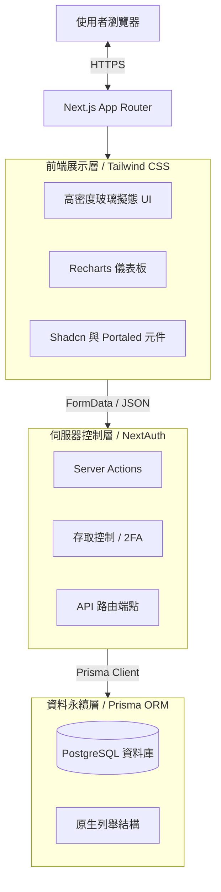
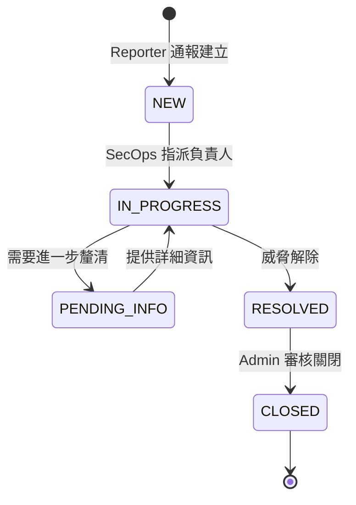
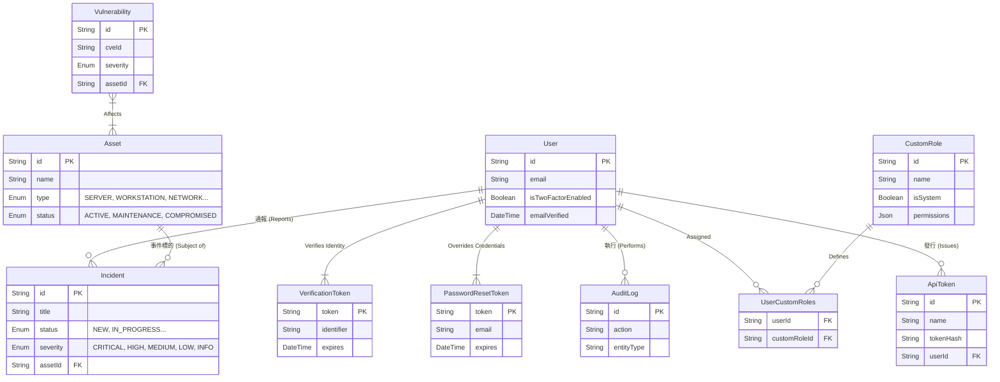
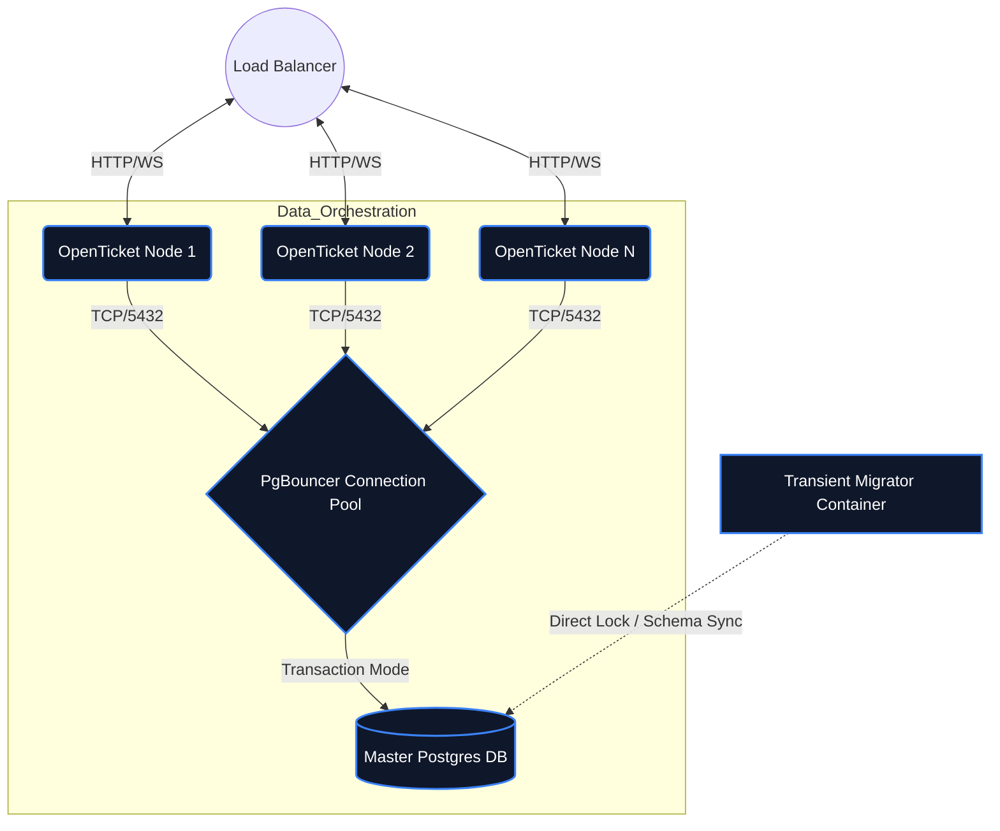
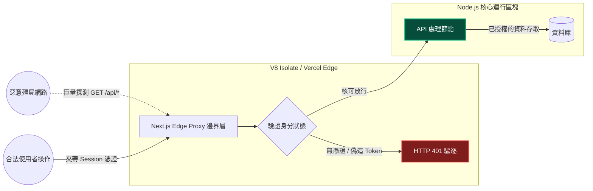

# OpenTicket 架構設計書 (Architecture)

一個強調簡潔性、當責與事件處置速度的資安事件與資產管理集中化平台。採用全端的單體式架構 (Monolithic Architecture)，並利用 Server Functions (伺服器動作) 來確保資料傳輸的速度與安全性。

[🌐 Read in English](../docs/ARCHITECTURE.md)

---

## 1. 高階系統架構圖 (High-Level Architecture)
本平台基於 Next.js 15 (App Router 架構) 打造。為了維持元件狀態的一致性，並避免複雜動態選單在 SSR 時發生水合錯誤 (Hydration Mismatch)，系統結合了 Radix/BaseUI 元件庫，並透過閉包技術來實作專用的資料解析機制。



---

## 2. 平台模組與工作流程 (Platform Modules & Workflows)

### 2.1 事件管理生命週期 (Incident Management Lifecycle)
系統的核心功能為追蹤直接關聯於組織基礎設施的資安事件，並具備嚴謹的狀態流轉機制。



### 2.2 關聯式資料庫結構 (ERD)
資料庫的 Schema 採用嚴格的關聯參照完整性 (Referential Integrity)。所有重大變更（包含事件流轉與資產關係的異動）都會觸發 Audit Log 稽核日誌模組，以確保系統具備不可否認性 (Non-repudiation)。



### 2.3 機器自動化介接 (Machine-to-Machine API Integration)
系統內建支援純服務互動 (Headless Execution) 的 REST 端點 (如 `/api/incidents`, `/api/assets`)。為了確保隔離性與權限可追溯性，外部整合會被要求夾帶 `Authorization: Bearer <token>` 標頭。這些金鑰在建立期會**自動繼承發放此金鑰的帳號權限** (動態細粒度權限矩陣)，藉此讓自動化機器人與呼叫者維持對等的資安授權邊界。

### 2.4 混合式外掛市集與事件總線 (Hybrid Plugin Sandbox)
為避免複雜的外部串接動作（如 Slack Webhooks、Teams 或 Jira 同步）阻塞主要的網頁執行緒，系統採用了 **零信任 Hook 引擎 (Zero-Trust Hook Engine)** 式的背景事件總線。所有主要的執行管道都會觸發內部的 EventBus，由它核對 PostgreSQL 中的 `PluginState` 後無縫地廣播非同步 Webhook。

### 原生外掛隔離策略
1. **API 限流沙盒 (API Limit Sandbox)**：所有的 Hook 執行邏輯都會被封裝在一個 `Promise.race()` 原語之中，並在超過 `5000ms` 後無條件拋出例外中斷執行。這能確保無窮迴圈或長時間沒有回應的外部 API 呼叫會在威脅系統反應能力前被迫崩潰中止。
2. **端對端加密 (End-to-End Cryptography)**：凡是包含有效 API 憑證 (Token) 的外掛參數，在系統將其寫入資料庫實體狀態前，都會綁定伺服器熵 (Server Entropy) 使用 `AES-256-GCM` 原生進行靜態加密。完全杜絕因為資料庫傾印 (Dump) 造成的機器金鑰外洩。
3. **OAuth 式權限批准 (OAuth-Style Privilege Consent)**：在安裝套件期間，遠端 Registry 會宣示權限。管理員將被強制經由「深潛式詳細資訊面板 (Deep-Dive Metadata Modal)」查閱從 `versions[].requestedPermissions` 提取的核心依賴清單。這項機制強制用戶意識到賦權範圍，阻止了盲目的同意授權。

外掛架構圍繞著縱深防禦 (Defense-in-Depth) 的框架建構，包含了五大核心防禦層：
1. **絕對身分閘道 (Absolute Identity Gating)**：外部外掛必須透過受限的 `api.createIncident()` SDK 進行互動，所有請求都會被強制向下轉交給無權限的沙盒機器人角色 (Sandbox Bot Role) 進行代理。
2. **授權清單簽證 (OAuth-Style Manifests)**：核心整合系統必須在 `manifest` 宣告所請求的操作權限。這些授權清單會在前端的 React Presentation 層彈出，強制等待管理員進行「Grant & Activate」的手動同意。後端同時會執行嚴格的集合交集 (Set-Intersections)，無情過濾任何外掛企圖暗中啟動的未授權 API。
3. **靜態密碼學防護 (Encryption At Rest)**：為了保證第三方設定 (例如 Webhook URLs, OAuth secrets) 不外洩，設定檔在存入資料庫前，皆會透過擷取自 `NEXTAUTH_SECRET` 的熵值，使用 `AES-256-GCM` 直接靜態加密，並且自帶 AuthTag 將資料庫被竄改的風險降至零。
4. **防雪崩快取 (Thundering Herd Eradication)**：高頻率的事件派發 (每秒可能高達 10,000+ 次 hook 廣播) 透過短暫生命週期的 (10秒) 同步 Context Cache 對射，徹底隔絕了對於 PostgreSQL `SELECT` 的查詢雪崩，所有相同的 DB 查詢全域僅會執行一次。
5. **時限炸彈沙盒 (Promise Time-Bomb Sandbox)**：為阻斷不良外部 API `fetch()` 或 `無窮迴圈` 造成的系統阻斷服務 (DoS) 與執行緒卡死，所有事件呼叫皆強制被包裝進 `Promise.race()` 系統中，若外掛執行超過 `5000ms`，將被系統強制斬斷管線，完美保護 Node 的單執行緒迴圈。
6. **UI 元件注入安全隔離 (UI Component Injection)**：不只侷限於伺服器邏輯，Registry 清單現在安全支援透過 `settingsPanels` API 傳遞 React 定義檔。此外，透過嶄新的 Hook 攔截點（如 `*MainWidgets` 與 `*SidebarWidgets`），外部開發者可以將自訂的 UI 模組，精準地外科手術式注入至事件、漏洞、資產或使用者配置頁的「主時間軸」或「側邊欄」內，且完全不會違反跨來源執行 (Cross-Origin) 的資安限制。
7. **零信任初始化隔離 (Zero-Trust Initialization)**：所有外掛在伺服器啟動時，皆被嚴密包裹於 `Error Boundaries` 與 `safeRequire` 隔離區塊內。如果外掛夾帶了會在編譯/渲染期造成崩潰的致命錯誤 (如 `SyntaxError`, `TypeReferenceError`)，該錯誤將被完美拘束與攔截，絕不允許其擴散並污染 Host Application 核心的事件迴圈 (Event Loop) 與連續運作。
8. **寫入前 AST 語法預檢 (Pre-Flight AST Syntax Checker)**：為了完全捨棄傳統編譯發生錯誤時的延遲崩潰風險，系統在下載外掛程式碼的瞬間，會直接呼叫底層的 `tsc` (TypeScript compiler) 進行即時預檢。利用解析出的抽象語法樹 (AST)，精準捕捉會造成當機的 `DiagnosticCategory.Error` 結構異常。一旦查獲致命語法，系統會直接拒絕寫入，完美達成檔案系統 (Filesystem) 零污染的自動安全撤銷與資料庫 Rollback。

```mermaid
graph TD
    SystemEvents[資料變異與事件] --> HookEngine((Zero-Trust Hook Engine))
    
    subgraph Execution_Sandbox [Engine 防護沙盒層]
        HookEngine --> CacheCheck{10秒 TTL Cache 檢查}
        CacheCheck -- "Miss" --> Decrypt[AES256 JSON 即時解密]
        CacheCheck -- "Hit" --> Exec[Promise.race 5000ms 執行炸彈]
        Decrypt --> Exec
    end
    
    Exec -->|嚴密限制的 SDK 邊界| Plugins[喚醒已隔離的第三方模組]
    
    subgraph Registry [遠端市集分發管線]
        RemoteRepo[GitHub Raw Module] -->|Server Action| Download[下載原始碼並校驗]
        Download --> UIAuth[UI 權限同意 Modal]
        UIAuth --> DBIntercept[後端權限交集 (Intersection)]
        DBIntercept --> Build[編譯 Webpack 生產包]
    end
```

### 2.5 全方位通知中心 (Omni-channel Notifications)
維運通報分為四大層級，透過 `User Preference` 分支為兩種底層通道，保障跨平台零延遲的系統警報。

```mermaid
graph TD
    SystemEvent[嚴峻資安系統事件] --> NotificationRouter{"用戶設定 (UserPreference)"}
    NotificationRouter -- "Enable Web Notifications" --> SSEQueue[伺服器發送事件 (SSE)]
    NotificationRouter -- "Enable Email" --> SMTP[SMTP Mailer Service]
    SSEQueue --> DesktopAlerts[作業系統桌面底層推播]
    SMTP --> AlertEmail[警報信件與註冊重置驗證信]
```

### 2.6 佈署與高可用性架構 (Deployments & High-Availability)
為了能夠承受在大規模水平擴展拓撲（如 Docker Swarm 或 Kubernetes）中的高可用性要求與突發流量，OpenTicket 透過了專用的 Sidecar 微服務架構，將具狀態 (Stateful) 的執行路徑徹底解耦。



**關鍵的執行典範 (Key Execution Paradigms)**:
1. **解耦遷移生命週期 (Migration Decoupling)**: 應用程式的 Schema 與資料庫無痛升級腳本（如 `upgrade-to-0.5.2.ts`）現在完全獨立於前端伺服器，被封裝進一個轉瞬即逝的 `migrator` 容器中執行。這從根本上消滅了多節點同時啟動時搶佔資料庫 Lock 的 Schema 崩潰。為防範 Standalone 極端縮減模式造成的腳本死鎖，現在該容器更嚴格鎖定於 Docker 的 `builder` 編譯階段執行，確保系統保留完整的 TypeScript 引擎 (`tsx`) 以完成零信任 API 的 M2M 機器身分遷移。
2. **交易級連線池 (Connection Pooling)**: 原生整合了強制處於 `Transaction` 模式的 `PgBouncer`，它能極度高效地快取並路由所有來自 React Server Action 的非同步請求，徹底避免動態查詢癱瘓核心資料庫的 `max_connections` (最大連線數) 上限。

---

## 3. 邊界安全與效能防護 (Edge Security & Boundary Defenses)

為了消除 Time-of-Check Time-of-Use (TOCTOU) DNS 重新綁定漏洞，以及 Layer 7 (應用層) 的巨量 HTTP DDoS 攻擊，OpenTicket 採用了嚴格的雙層防禦邊界，將 Node.js 核心執行緒與潛在的惡意網路拓樸實體隔離。

### 3.1 邊界防火牆 (Layer 7 Defense)
框架會透過 Next.js Edge Runtimes (`proxy.ts`) 瞬間攔截所有未授權的負載。缺乏有效 Token 或 Session 的惡意連線會直接在邊界被拋棄，完全不會觸碰到核心的 Node.js 運行環境或拖垮 PostgreSQL 連線池。



### 3.2 免疫 DNS Rebinding 與 SSRF 阻擊
為了防堵對內部系統的伺服器端請求偽造 (SSRF，如利用 Webhook 存取被掏空的 EC2 Metadata 或 Loopback IP)，外部請求會在解析前被剝離抽象的 Host 目標。系統會強制將其解析為實體的 IPv4 並短暫凍結在記憶體中進行比對。

```typescript
// 防禦 TOCTOU SSRF 攻擊的情境切片
const resolvedIps = await dns.resolve4(parsed.hostname);
const pinnedIp = resolvedIps[0]; // 凍結物理網路拓樸

if (isPrivateIP(pinnedIp)) {
    throw new Error("轉發目標解析為內部 RFC1918 / 私密網段，拒絕存取");
}

// 模擬原生 Host 狀態，但強制打擊已凍結的靜態 IP
await fetch(`https://${pinnedIp}${parsed.pathname}`, {
    headers: { "Host": parsed.hostname } // 防止 SNI 與反向代理丟失
});
```

---

## 4. 關鍵技術決策 (ADR - Architecture Decision Records)

* **Server Actions 優先於 REST API：** 多數的內部狀態異動直接採用 React 的伺服器動作（標註 `"use server"`），並直接處理 `FormData`。這不僅省去了撰寫 `fetch/axios` 的繁瑣程式碼，還能立刻在後端執行驗證。
* **PostgreSQL 原生全文檢索 (tsvector)**: 為了徹底消除資料庫在數百萬筆 Log 日誌中執行 `%LIKE%` 模糊比對所產生的災難性 `O(N)` N+1 延遲，架構全面捨棄了傳統的 Wildcard 查詢。我們採用了 Postgres 原生的 `tsvector / tsquery` 全文檢索索引矩陣，實現了突破性的 UI 檢索延遲壓縮與大規模並行能力。
* **全同步式對話框的退場 (Asynchronous Modal)**: 系統全局拔除了會導致瀏覽器執行緒阻塞與畫面凍結的原生警告區塊 (`window.alert`, `window.confirm`)。我們全面匯入了無阻塞的 React Shadcn Portaled `<Dialog>` 非同步架構，不僅提升了視覺的連續性，更保護了 UI Event-Loop 的狀態免疫力。
* **動態細粒度權限矩陣 (Dynamic Granular Permission Matrix)：** 我們並未選擇使用多個斷開的布林值（如 `isAdmin`, `isSecops`），而是直接使用 PostgreSQL 關聯表單與 `JSON` 原生結構設計了強大的角色控制總線。這不僅實現了重疊權限分配，也達成讓管理員隨意組合原子操作（例如：單純配發 `CREATE_INCIDENTS`），未來若有新型能力需求，也無須經歷繁瑣的 Database Schema 遷移歷程。
* **API Token 密碼學儲存機制：** 資料庫拒絕存放明文形式的 `ApiToken` 連線密鑰。當外部系統提出發行請求時，OpenTicket 會呼叫 `crypto.randomBytes(24)` 生成出一組 48 字元的 16 進位字串供操作員複製，並對該字串實施不可逆的 `SHA-256` 雜湊入庫儲存。爾後 API 運行時期的驗證也都透過安全雜湊比對，阻斷任何橫向提權的風險。
* **元件層級列舉與資料庫列舉對齊：** Prisma 會在不同的應用層以不同的方式解讀字串。我們讓資料庫強制維持原生 PostgreSQL Enum 的命名規範（例如 `IN_PROGRESS`），由於 Next.js React 渲染層不適合顯示帶底線的字串，我們在 UI 層統一呈現無底線字串（例如 `IN PROGRESS`），並在傳回 Server Action 時自動重新組合，以兼容資料庫。
* **從源頭確保安全性 (Security at Inception)：** 
   - 透過 `Auth.js` 強制實施零次設定即可啟用的安全 Cookie 策略。
   - 移除了存在偽隨機數漏洞與已棄用的依賴項（如 `bcryptjs`），全面升級為經過 C++ 編譯驗證的 `bcrypt` 套件。
   - 系統後台包含一鍵切換的全域強制開啟 2FA 開關 (`SystemSetting`)，一旦開啟，任何未綁定 OTP 二階段驗證的使用者都會被限制執行高風險動作（拋出 `Global2FAEnforcedError`），實現徹底的安全隔離。
   - **防禦撞庫攻擊 (Brute Force Defense)**：實作無狀態的 in-memory 頻率限制 (Rate Limiting) 與登入端點綁定，有效壓制分散式帳號爆破。
   - **防禦越權存取 (Strict BOLA Adherence)**：對於評論 (Comments) 與事件編輯，於後台強行評估該物件擁有者的連帶防護，拒絕越權竄改 (Direct Object Reference) 繞過預設的授權信任環。
* **層級與溢位管理策略 (Z-Index & Overflow Hierarchy)：** 為了實現高密度的集中化儀表板，我們在玻璃擬態卡片中大量使用了 `overflow-hidden` 強制邊界。為避免底層選單與第三方覆蓋元件（如 `react-datepicker`）因此遭到截斷裁切，我們積極引入 React Portals 架構與手動提權的 Z-Index ，使彈出式浮層能夠脫離原有的 DOM 封裝樹，直接渲染在最頂層。
* **伺服器端外掛熱重載 (Server-Side Registry Orchestration)**：利用 Node.js 原生的 `child_process.exec` 功能，在安全範圍內接受指令後觸發編譯器的重組 (`next build`)。並於最終回傳 `process.exit(0)`，將高可用性的重啟任務委託給背景守護進程 (如 PM2, Kubernetes) 處理。此架構達成幾乎零停機的外掛發布流程。
