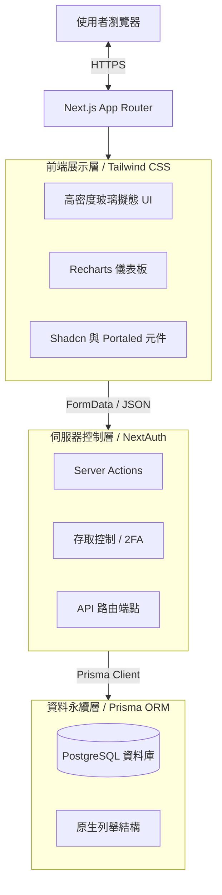
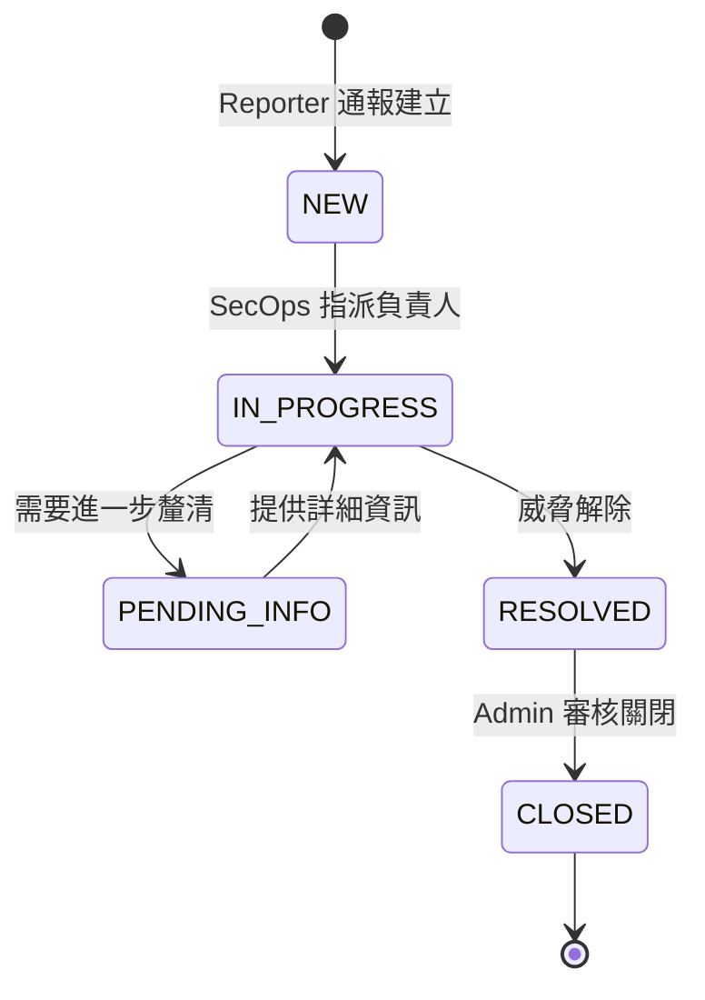
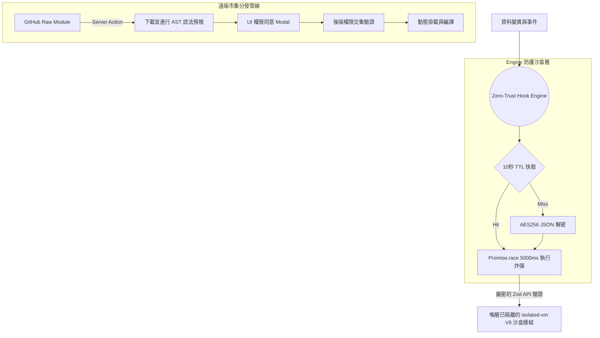
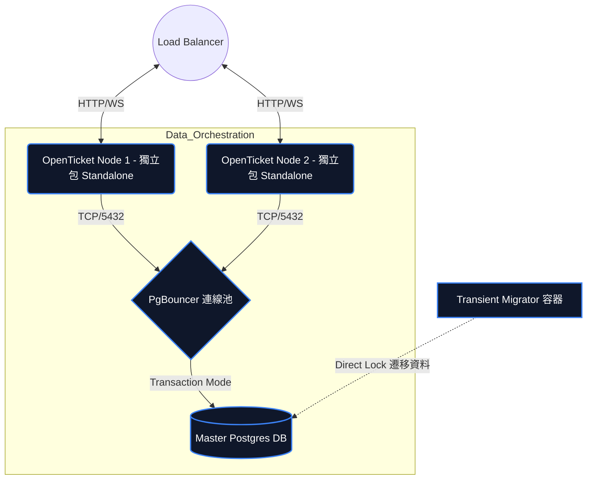

# OpenTicket 架構設計書 (Architecture)

一個強調簡潔性、當責與事件處置速度的資安事件與資產管理集中化平台。採用全端的單體式架構 (Monolithic Architecture)，並利用 Server Functions (伺服器動作) 來確保資料傳輸的速度與安全性。

[🌐 Read in English](ARCHITECTURE.md)

---

## 1. 高階系統架構圖 (High-Level Architecture)
本平台基於 Next.js 16.2 (App Router 架構) 打造。為了維持元件狀態的一致性，並避免複雜動態選單在 SSR 時發生水合錯誤 (Hydration Mismatch)，系統結合了 Radix/BaseUI 元件庫與 Shadcn/UI，並透過閉包技術來實作專用的資料解析機制。



---

## 2. 平台模組與工作流程 (Platform Modules & Workflows)

### 2.1 事件管理生命週期 (Incident Management Lifecycle)
系統的核心功能為追蹤直接關聯於組織基礎設施的資安事件，並具備嚴謹的狀態流轉機制。



### 2.2 關聯式資料庫結構 (ERD)
資料庫的 Schema 採用嚴格的關聯參照完整性 (Referential Integrity)。所有重大變更（包含事件流轉與資產關係的異動）都會觸發 Audit Log 稽核日誌模組，以確保系統具備不可否認性 (Non-repudiation)。全域系統設定由 `SystemSetting` 單體物件維護。

```mermaid
erDiagram
    SystemSetting {
        String id PK
        Boolean smtpEnabled
        Enum mailerProvider
    }
    PluginState {
        String id PK
        Boolean isActive
        String configJson
    }
    User {
        String id PK
        String email
        Boolean isTwoFactorEnabled
        String twoFactorSecret
        Boolean notifyOnCritical
    }
    CustomRole {
        String id PK
        String name
        Boolean isSystem
        EnumArray permissions
    }
    UserCustomRoles {
        String userId FK
        String customRoleId FK
    }
    ApiToken {
        String id PK
        String name
        String tokenHash
        String userId FK
    }
    Asset {
        String id PK
        String name
        Enum type "SERVER, WORKSTATION, NETWORK..."
        Enum status "ACTIVE, MAINTENANCE, COMPROMISED"
    }
    Incident {
        String id PK
        String title
        Enum status "NEW, IN_PROGRESS..."
        Enum severity "CRITICAL, HIGH, MEDIUM, LOW, INFO"
        String assetId FK
    }
    Vulnerability {
        String id PK
        String cveId
        Enum severity
        String assetId FK
    }
    Comment {
        String id PK
        String content
        String targetId FK
        String userId FK
    }
    Attachment {
        String id PK
        String filename
        String incidentId FK
        String vulnId FK
    }
    UserNotification {
        String id PK
        String title
        String userId FK
    }
    AuditLog {
        String id PK
        String action
        String entityType
    }
    LoginAttempt {
        String id PK
        String ip
        String identifier
        DateTime createdAt
    }
    VulnerabilityAsset {
        String id PK
        String vulnId FK
        String assetId FK
        Enum status "AFFECTED, MITIGATED, PATCHED"
    }
    Invitation {
        String id PK
        String email
        String token
        String inviterId FK
    }
    MetricSnapshot {
        String id PK
        String metricName
        Float value
        DateTime recordedAt
    }
    Account {
        String id PK
        String provider
        String providerAccountId
        String userId FK
    }
    Session {
        String id PK
        String sessionToken
        String userId FK
    }

    User ||--o{ Incident : "通報 (Reports)"
    Asset ||--o{ Incident : "事件標的 (Subject of)"
    Vulnerability ||--o{ VulnerabilityAsset : "攻擊目標 (Targets)"
    Asset ||--o{ VulnerabilityAsset : "包含 (Contains)"
    Incident ||--o{ Comment : "包含回應 (Contains)"
    Vulnerability ||--o{ Comment : "包含回應 (Contains)"
    User ||--o{ Comment : "撰寫 (Authors)"
    User ||--o{ AuditLog : "執行 (Performs)"
    User ||--o{ UserCustomRoles : "Assigned"
    CustomRole ||--o{ UserCustomRoles : "Defines"
    User ||--o{ ApiToken : "發行 (Issues)"
    User ||--o{ Attachment : "上傳 (Uploads)"
    User ||--o{ UserNotification : "接收警報 (Receives)"
    User ||--o{ Invitation : "發送邀請 (Sends)"
    User ||--o{ Account : "綁定 (Linked to)"
    User ||--o{ Session : "維持 (Maintains)"
```



### 2.3 機器自動化介接 (Machine-to-Machine API) 與 PAT 金鑰
系統內建支援純服務互動 (Headless Execution) 的 REST 端點 (如 `/api/incidents`, `/api/assets`)。外部整合會被要求夾帶 `Authorization: Bearer <token>` 標頭。這些金鑰在建立期會**自動繼承發放此金鑰的帳號權限** (動態細粒度權限矩陣)。生成時將自動以 `SHA-256` 進行不可逆雜湊，防止原文密碼從資料庫中外流。

### 2.4 混合式外掛市集與事件總線 (Hybrid Plugin Sandbox)
為避免複雜的外部串接動作阻塞主要的網頁執行緒，系統採用了 **零信任 Hook 引擎 (Zero-Trust Hook Engine)** 式的背景事件總線。所有主要的執行管道都會觸發內部的 EventBus，由它核對 `PluginState` 後無縫地廣播非同步 Webhook。

### 原生外掛隔離策略
1. **API 限流沙盒 (Memory & Time Limits)**：所有的 Hook 執行邏輯都會被封裝在一個 `Promise.race()` 原語之中，並在超過 `5000ms` 後無條件拋出例外。並被放置於隔離的 `isolated-vm` 虛擬 V8 引擎環境內，同時實施 128MB 的嚴格實體記憶體限制，確保外掛洩漏不會影響 Host 的 Node.js。
2. **端對端加密 (End-to-End Cryptography)**：凡是包含有效 API 憑證 (Token) 的外掛參數，在寫入資料庫實體狀態前，都會綁定伺服器熵使用 `AES-256-GCM` 原生進行靜態加密。完全杜絕因為資料庫傾印造成的金鑰外洩。
3. **Zod 驗證邊界 (Zod Schema Boundaries)**：核心的 SDK（例如 `api.createIncident()` 等呼叫）完全由 Zod 強制接管輸入 payloads。外掛無法利用畸形物件進行原型污染 (Prototype Pollution) 或讓 Prisma 資料庫拋出無效錯誤。
4. **OAuth 式權限批准 (OAuth-Style Consent)**：在遠端 Registry 安裝套件期間會宣示權限。管理員將被強制查閱 `versions[].requestedPermissions`。後端同時會執行嚴格的集合交集 (Set-Intersections)，無情過濾任何外掛企圖暗中啟動的未授權 API。

外掛架構圍繞著縱深防禦 (Defense-in-Depth) 的框架建構，包含了多重核心防禦層：
1. **絕對身分閘道 (Absolute Identity Gating)**：外部外掛必須透過受限的 SDK 進行互動，所有請求都會被強制向下轉交給指定的沙盒機器人角色 (Sandbox Bot Role) 進行代理。
2. **靜態密碼學防護 (Encryption At Rest)**：設定檔在存入資料庫前，將透過 `AES-256-GCM` 直接靜態加密，並且自帶 AuthTag 將資料庫被竄改的風險降至零。
3. **寫入前 AST 語法預檢 (Pre-Flight AST Syntax Checker)**：系統在下載外掛程式碼的瞬間，會呼叫底層的 `tsc`。利用解析抽象語法樹 (AST)，精準捕捉 `DiagnosticCategory.Error` 致命錯誤。查獲致命語法將會直接拒絕寫入與掛載，防範了因為遠端惡意程式碼而癱瘓伺服器編譯路徑。
4. **UI 元件注入安全隔離 (UI Component Injection)**：除了伺服器後端，Registry 外掛現在安全支援注入自訂 React UI 模組，允許精準地外科手術式注入至事件、漏洞、資產的「主時間軸」或「側邊欄」內。透過 `isomorphic-dompurify` 的協助，完全消除了透過 UI 模組注入的 XSS (跨站腳本攻擊) 風險。



### 2.5 全方位通知中心 (Omni-channel Notifications)
維運通報透過 `User Preference` 分支，並支援動態切換三家主流的郵件供應商引擎，保障跨平台零延遲的系統警報。

```mermaid
graph TD
    SystemEvent[重點資安事件] --> NotificationRouter{"用戶設定 (UserPreference)"}
    NotificationRouter -- "Enable Web Notifications" --> SSEQueue[伺服器發送事件 (SSE)]
    NotificationRouter -- "Enable Email" --> MailerEngine{"SystemSetting 收發引擎"}
    SSEQueue --> DesktopAlerts[作業系統桌面 HTML5 底層推播]
    MailerEngine -- "SMTP" --> SMTP_Provider[Nodemailer 原生 SMTP]
    MailerEngine -- "RESEND" --> Resend_API[Resend 官方 REST API]
    MailerEngine -- "SENDGRID" --> SendGrid_API[SendGrid 官方 REST API]
```

### 2.6 佈署與高可用性架構 (Deployments & High-Availability)
為了能夠承受在大規模水平擴展拓撲（如 Docker Swarm 或 Kubernetes）中的高可用性要求，OpenTicket 將具狀態 (Stateful) 的資料庫遷移生命週期徹底解耦。



**關鍵的執行典範 (Key Execution Paradigms)**:
1. **解耦遷移生命週期 (Migration Decoupling)**: 應用程式的 Schema 與資料庫無痛升級腳本獨立於前端伺服器，被封裝進一個轉瞬即逝的 `migrator` 容器中執行，消滅了多節點同時啟動時搶佔資料庫 Lock 的 Schema 崩潰。
2. **交易級連線池 (Connection Pooling)**: 原生整合了強制處於 `Transaction` 模式的 `PgBouncer`，它能極度高效地快取並路由所有來自 React Server Action 的非同步請求，徹底避免動態查詢癱瘓核心資料庫。

---

## 3. 邊界安全與效能防護 (Edge Security & Boundary Defenses)

為了消除 Time-of-Check Time-of-Use (TOCTOU) DNS 重新綁定漏洞，以及 Layer 7 (應用層) 的巨量 HTTP DDoS 攻擊，OpenTicket 採用了嚴格的雙層防禦邊界。

### 3.1 邊界防火牆 (Layer 7 Defense)
框架會透過 Next.js Edge Runtimes (`proxy.ts`) 瞬間攔截所有未授權的負載。缺乏有效 Token 或 Session 的連線會直接在邊界被拋棄，完全不會觸碰到核心的 Node.js 運行環境。


### 3.2 免疫 DNS Rebinding 與 SSRF 阻擊
為了防堵對內部系統的伺服器端請求偽造 (SSRF)，外部請求會在解析前被剝離抽象的 Host 目標，強制解析並凍結為實體的 IPv4/IPv6。系統會強行攔截所有嘗試導向 `127.0.0.0/8`, `10.0.0.0/8`, `172.16.0.0/12`, `192.168.0.0/16` 及 `169.254.169.254` (雲端中繼資料) 的惡意網段。

```typescript
// 防禦 TOCTOU SSRF 攻擊的情境切片
const resolvedIps = await dns.resolve4(parsed.hostname);
const pinnedIp = resolvedIps[0]; // 凍結物理網路拓樸

if (isPrivateIP(pinnedIp)) {
    throw new Error("轉發目標解析為內部私有網段，拒絕存取");
}

// 模擬原生 Host 狀態，強制打擊已凍結的靜態 IP
await fetch(`https://${pinnedIp}${parsed.pathname}`, {
    headers: { "Host": parsed.hostname } // 防止 SNI 與反向代理丟失
});
```

---

## 4. 關鍵技術決策 (ADR - Architecture Decision Records)

* **Server Actions 優先於 REST API：** 多數內部狀態異動直接採用 Server Actions（`"use server"`）直接處理 `FormData`，省去了撰寫 `fetch/axios` 並在後端即時驗證。
* **PostgreSQL 原生全文檢索 (tsvector)**: 為了消除資料庫在數百萬筆 Log 執行 `%LIKE%` 模糊比對所產生的災難性 N+1 延遲，我們採用 Postgres 原生 `tsvector / tsquery` 全文檢索索引矩陣，確保極高的文字搜尋效能。
* **分散式頻率限制 (Distributed Rate Limiting)**: 使用獨立資料庫追蹤來源 IP 與目標帳號鎖定，在完全不需要 Redis 伺服器的情況下原生抑制暴力破解與密碼噴灑。
* **全域配置與多重郵件抽象層 (Global Toggles & Multi-Mailer)**：我們透過單例化的 `SystemSetting` 進行全域邊界設定（如 `Global2FAEnforcedError`），並將發信邏輯 (Resend, SendGrid, SMTP) 完全抽象於 UI 服務之後。
* **嚴謹的 RBAC 權限矩陣設計 (Strict Role-Based Access Control)**：有別於鬆散的 JSON 結構，我們原生支援由 PostgreSQL 限定型別的多重枚舉陣列 (`Permission[]`) 來建立多對多的 CustomRole 關聯。在保有動態配置能力的同時，嚴格阻絕了無定型的 NoSQL JSON 欄位變異風險，確保全資料庫型別安全。
* **多重信件提供商 (Multi-Provider Mailer)：** 放棄將發信邏輯硬編碼死綁 SMTP，改以支援彈性從 UI 介面即時熱切換成 SMTP、或者更穩定的第三方服務如 Resend API 或 SendGrid API。
* **API Token 密碼學儲存機制：** 資料庫拒絕存放明文形式的金鑰。發行請求時呼叫 `crypto.randomBytes(24)` 生成並進行不可逆的 `SHA-256` 雜湊入庫。
* **從源頭確保安全性 (Security at Inception)：** 
   - 透過 `Auth.js` 強制預設安全 Cookie 的策略。
   - 移除了存在偽隨機數漏洞與已棄用的依賴項改以強化版的 C++ `bcrypt` 編譯套件為主。
   - `SystemSetting` 中的全域開啟 2FA 開關可以直接限制全站任何無配置 OTP 的行為（拋出 `Global2FAEnforcedError`）。
   - **防禦越權存取**：強行評估該物件擁有者的連帶防護，拒絕越權竄改 (BOLA) 覆寫原本被信任的權限層。
   - **防禦 CSV 注入 (DDE Mitigation)**：所有的系統資料匯出皆受制於端點級聯的跳脫層，強制對於以 `=, +, -, @` 開頭的儲存格插入跳脫字元，徹底阻斷惡意載荷在管理員 Excel 內執行任意系統巨集的資安風險。
* **層級與溢位管理策略 (Z-Index & Overflow Hierarchy)：** 為實現高密度的集中化儀表板，在卡片中大量使用了 `overflow-hidden` 強制邊界。為避免下拉選單因此遭到截斷裁切，我們引入 React Portals 架構與手動提權的 Z-Index ，使浮出選單與日曆選擇器能脫離 DOM 封裝樹。
* **伺服器端外掛熱重載 (Server-Side Registry Orchestration)**：利用 Node.js 的 `child_process.exec` 功能在背景接受指令觸發編譯器的重組 (`next build`)。並於回傳 `process.exit(0)`，將 Node 的高可用性重啟任務委託給 Docker 或 Host Daemon (PM2) 處理，達成真正的自動熱更佈署。
