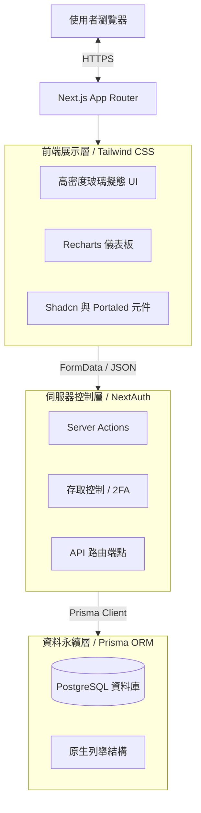
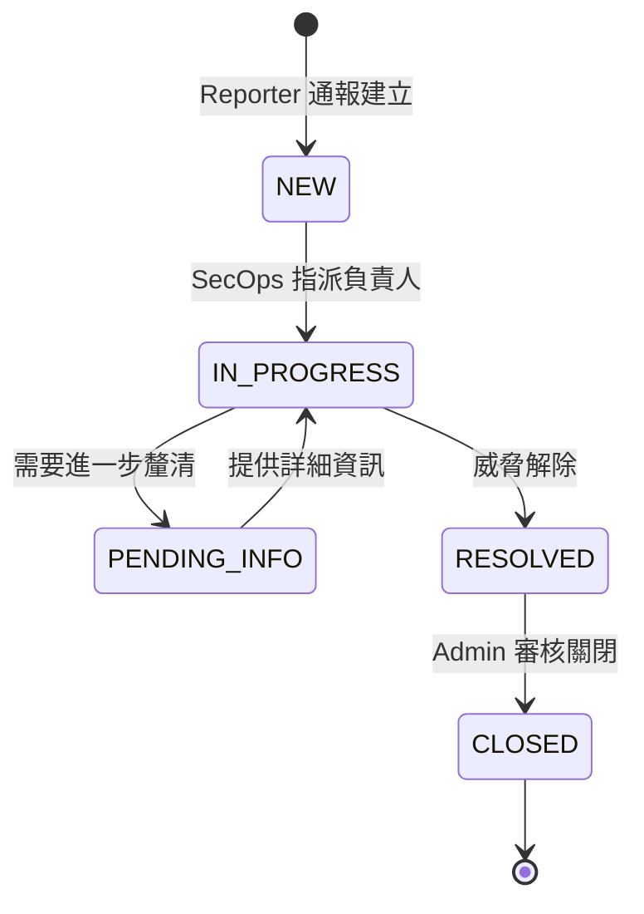
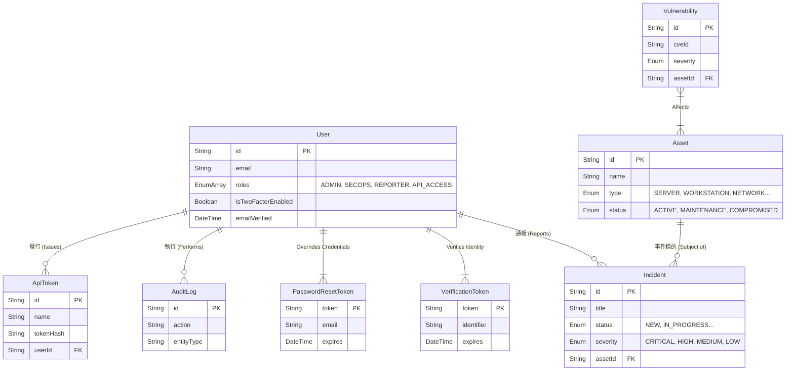

# OpenTicket 架構設計書 (Architecture)

一個強調簡潔性、當責與事件處置速度的資安事件與資產管理集中化平台。採用全端的單體式架構 (Monolithic Architecture)，並利用 Server Functions (伺服器動作) 來確保資料傳輸的速度與安全性。

[🌐 Read in English](../docs/ARCHITECTURE.md)

---

## 1. 高階系統架構圖 (High-Level Architecture)
本平台基於 Next.js 15 (App Router 架構) 打造。為了維持元件狀態的一致性，並避免複雜動態選單在 SSR 時發生水合錯誤 (Hydration Mismatch)，系統結合了 Radix/BaseUI 元件庫，並透過閉包技術來實作專用的資料解析機制。

---

## 2. 平台模組與工作流程 (Platform Modules & Workflows)

### 2.1 事件管理生命週期 (Incident Management Lifecycle)
系統的核心功能為追蹤直接關聯於組織基礎設施的資安事件，並具備嚴謹的狀態流轉機制。

### 2.2 關聯式資料庫結構 (ERD)
資料庫的 Schema 採用嚴格的關聯參照完整性 (Referential Integrity)。所有重大變更（包含事件流轉與資產關係的異動）都會觸發 Audit Log 稽核日誌模組，以確保系統具備不可否認性 (Non-repudiation)。

### 2.3 機器自動化 API 介接 (Machine-to-Machine API Integration)
系統內建無頭腳本模式 (Headless)，支援透過主要資料路由 (`/api/incidents`, `/api/assets`) 進行操作。為了維持嚴格的 BOLA 隔離與身分繼承，自動化介接一律採用密碼學令牌，藉由 `Authorization: Bearer <token>` 請求頭進行驗證。這些 Token 必須由已授權的維運單位生成，並且 Token 發出後，會「完全繼承發行者當下的所有陣列權限標籤」。

---

## 3. 關鍵技術決策 (ADR - Architecture Decision Records)

* **Server Actions 優先於 REST API：** 多數的內部狀態異動直接採用 React 的伺服器動作（標註 `"use server"`），並直接處理 `FormData`。這不僅省去了撰寫 `fetch/axios` 的繁瑣程式碼，還能立刻在後端執行驗證。
* **陣列化多角色存取控制 (Multi-Role RBAC)：** 我們並未選擇使用多個斷開的布林值（如 `isAdmin`, `isSecops`），而是直接使用 PostgreSQL 原生支援的 Array 陣列結構結合 Prisma。這不僅實現了重疊權限分配（例如：[`SECOPS`, `API_ACCESS`]），未來若有新型角色需求，也無須經歷繁瑣的 Database Schema 遷移歷程。
* **API Token 密碼學儲存機制：** 資料庫拒絕存放明文形式的 `ApiToken` 連線密鑰。當外部系統提出發行請求時，OpenTicket 會呼叫 `crypto.randomBytes(24)` 生成出一組 48 字元的 16 進位字串供操作員複製，並對該字串實施不可逆的 `SHA-256` 雜湊入庫儲存。爾後 API 運行時期的驗證也都透過安全雜湊比對，阻斷任何橫向提權的風險。
* **元件層級列舉與資料庫列舉對齊：** Prisma 會在不同的應用層以不同的方式解讀字串。我們讓資料庫強制維持原生 PostgreSQL Enum 的命名規範（例如 `IN_PROGRESS`），由於 Next.js React 渲染層不適合顯示帶底線的字串，我們在 UI 層統一呈現無底線字串（例如 `IN PROGRESS`），並在傳回 Server Action 時自動重新組合，以兼容資料庫。
* **從源頭確保安全性 (Security at Inception)：** 
   - 透過 `Auth.js` 強制實施零次設定即可啟用的安全 Cookie 策略。
   - 移除了存在偽隨機數漏洞與已棄用的依賴項（如 `bcryptjs`），全面升級為經過 C++ 編譯驗證的 `bcrypt` 套件。
   - 系統後台包含一鍵切換的全域強制開啟 2FA 開關 (`SystemSetting`)，一旦開啟，任何未綁定 OTP 二階段驗證的使用者都會被限制執行高風險動作（拋出 `Global2FAEnforcedError`），實現徹底的安全隔離。
* **層級與溢位管理策略 (Z-Index & Overflow Hierarchy)：** 為了實現高密度的集中化儀表板，我們在玻璃擬態卡片中大量使用了 `overflow-hidden` 強制邊界。為避免底層選單與第三方覆蓋元件（如 `react-datepicker`）因此遭到截斷裁切，我們積極引入 React Portals 架構與手動提權的 Z-Index ，使彈出式浮層能夠脫離原有的 DOM 封裝樹，直接渲染在最頂層。
