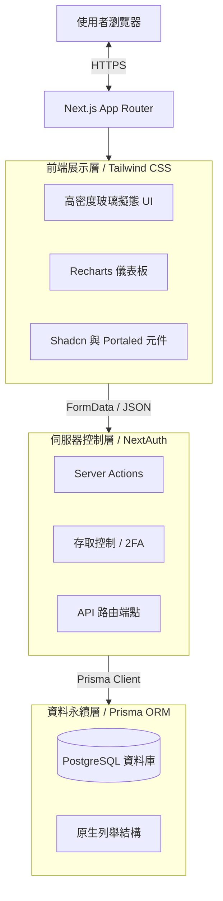
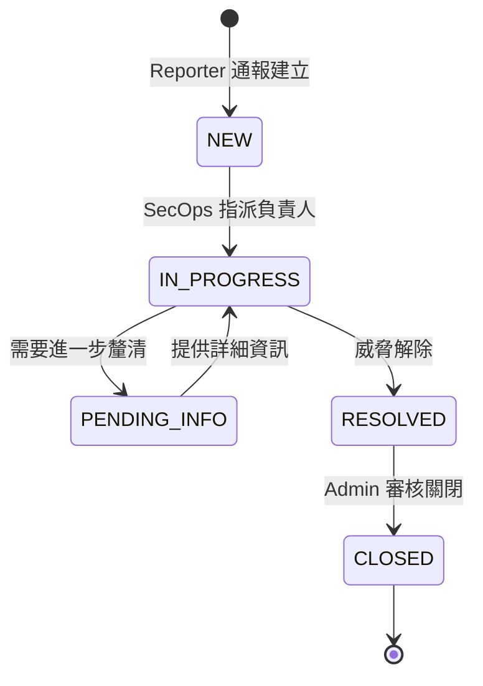
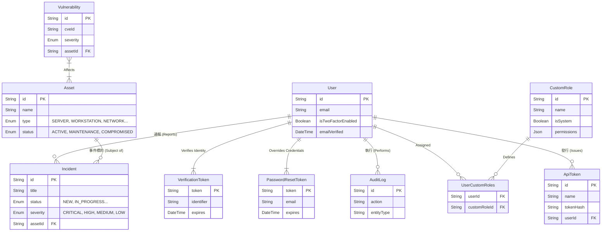
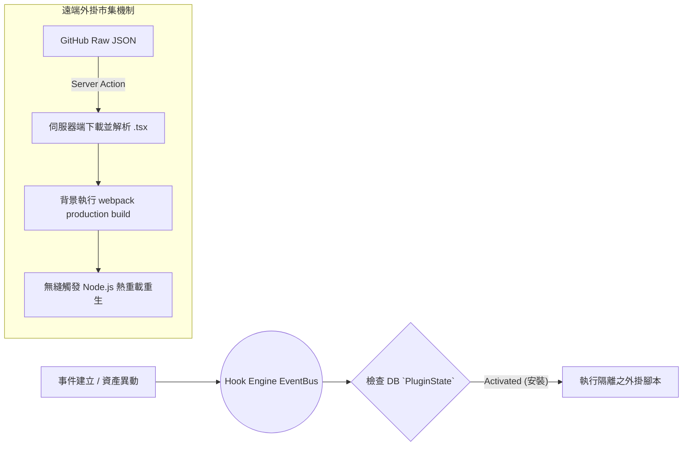

# OpenTicket 架構設計書 (Architecture)

一個強調簡潔性、當責與事件處置速度的資安事件與資產管理集中化平台。採用全端的單體式架構 (Monolithic Architecture)，並利用 Server Functions (伺服器動作) 來確保資料傳輸的速度與安全性。

[🌐 Read in English](../docs/ARCHITECTURE.md)

---

## 1. 高階系統架構圖 (High-Level Architecture)
本平台基於 Next.js 15 (App Router 架構) 打造。為了維持元件狀態的一致性，並避免複雜動態選單在 SSR 時發生水合錯誤 (Hydration Mismatch)，系統結合了 Radix/BaseUI 元件庫，並透過閉包技術來實作專用的資料解析機制。



---

## 2. 平台模組與工作流程 (Platform Modules & Workflows)

### 2.1 事件管理生命週期 (Incident Management Lifecycle)
系統的核心功能為追蹤直接關聯於組織基礎設施的資安事件，並具備嚴謹的狀態流轉機制。



### 2.2 關聯式資料庫結構 (ERD)
資料庫的 Schema 採用嚴格的關聯參照完整性 (Referential Integrity)。所有重大變更（包含事件流轉與資產關係的異動）都會觸發 Audit Log 稽核日誌模組，以確保系統具備不可否認性 (Non-repudiation)。



### 2.3 機器自動化介接 (Machine-to-Machine API Integration)
系統內建支援純服務互動 (Headless Execution) 的 REST 端點 (如 `/api/incidents`, `/api/assets`)。為了確保隔離性與權限可追溯性，外部整合會被要求夾帶 `Authorization: Bearer <token>` 標頭。這些金鑰在建立期會**自動繼承發放此金鑰的帳號權限** (動態細粒度權限矩陣)，藉此讓自動化機器人與呼叫者維持對等的資安授權邊界。

### 2.4 混合式外掛市集與事件總線 (Hybrid Plugin Architecture)
為避免核心後端路由被各種獨立開發的外部擴充功能 (如遠端推播、雙向同步腳本) 阻塞，本系統採用非同步的 **Hook Engine**。所有的核心事件 (建立事件/資產覆滅等) 皆會被派發至 EventBus，進而觸發完全脫離於主機體之外的外掛邏輯。

不僅如此，OpenTicket 導入了 **混合分發模式 (Hybrid Registry)**，賦予管理員直接透過 UI 瀏覽並安裝遠端 Github Registry 外掛的特權。


### 2.5 全方位通知中心 (Omni-channel Notifications)
維運通報分為四大層級，透過 `User Preference` 分支為兩種底層通道，保障跨平台零延遲的系統警報。

```mermaid
graph TD
    SystemEvent[嚴峻資安系統事件] --> NotificationRouter{"用戶設定 (UserPreference)"}
    NotificationRouter -- "Enable Web Notifications" --> SSEQueue[伺服器發送事件 (SSE)]
    NotificationRouter -- "Enable Email" --> SMTP[SMTP Mailer Service]
    SSEQueue --> DesktopAlerts[作業系統桌面底層推播]
    SMTP --> AlertEmail[警報信件與註冊重置驗證信]
```

---

## 3. 關鍵技術決策 (ADR - Architecture Decision Records)

* **Server Actions 優先於 REST API：** 多數的內部狀態異動直接採用 React 的伺服器動作（標註 `"use server"`），並直接處理 `FormData`。這不僅省去了撰寫 `fetch/axios` 的繁瑣程式碼，還能立刻在後端執行驗證。
* **動態細粒度權限矩陣 (Dynamic Granular Permission Matrix)：** 我們並未選擇使用多個斷開的布林值（如 `isAdmin`, `isSecops`），而是直接使用 PostgreSQL 關聯表單與 `JSON` 原生結構設計了強大的角色控制總線。這不僅實現了重疊權限分配，也達成讓管理員隨意組合原子操作（例如：單純配發 `CREATE_INCIDENTS`），未來若有新型能力需求，也無須經歷繁瑣的 Database Schema 遷移歷程。
* **API Token 密碼學儲存機制：** 資料庫拒絕存放明文形式的 `ApiToken` 連線密鑰。當外部系統提出發行請求時，OpenTicket 會呼叫 `crypto.randomBytes(24)` 生成出一組 48 字元的 16 進位字串供操作員複製，並對該字串實施不可逆的 `SHA-256` 雜湊入庫儲存。爾後 API 運行時期的驗證也都透過安全雜湊比對，阻斷任何橫向提權的風險。
* **元件層級列舉與資料庫列舉對齊：** Prisma 會在不同的應用層以不同的方式解讀字串。我們讓資料庫強制維持原生 PostgreSQL Enum 的命名規範（例如 `IN_PROGRESS`），由於 Next.js React 渲染層不適合顯示帶底線的字串，我們在 UI 層統一呈現無底線字串（例如 `IN PROGRESS`），並在傳回 Server Action 時自動重新組合，以兼容資料庫。
* **從源頭確保安全性 (Security at Inception)：** 
   - 透過 `Auth.js` 強制實施零次設定即可啟用的安全 Cookie 策略。
   - 移除了存在偽隨機數漏洞與已棄用的依賴項（如 `bcryptjs`），全面升級為經過 C++ 編譯驗證的 `bcrypt` 套件。
   - 系統後台包含一鍵切換的全域強制開啟 2FA 開關 (`SystemSetting`)，一旦開啟，任何未綁定 OTP 二階段驗證的使用者都會被限制執行高風險動作（拋出 `Global2FAEnforcedError`），實現徹底的安全隔離。
   - **防禦撞庫攻擊 (Brute Force Defense)**：實作無狀態的 in-memory 頻率限制 (Rate Limiting) 與登入端點綁定，有效壓制分散式帳號爆破。
   - **防禦越權存取 (Strict BOLA Adherence)**：對於評論 (Comments) 與事件編輯，於後台強行評估該物件擁有者的連帶防護，拒絕越權竄改 (Direct Object Reference) 繞過預設的授權信任環。
* **層級與溢位管理策略 (Z-Index & Overflow Hierarchy)：** 為了實現高密度的集中化儀表板，我們在玻璃擬態卡片中大量使用了 `overflow-hidden` 強制邊界。為避免底層選單與第三方覆蓋元件（如 `react-datepicker`）因此遭到截斷裁切，我們積極引入 React Portals 架構與手動提權的 Z-Index ，使彈出式浮層能夠脫離原有的 DOM 封裝樹，直接渲染在最頂層。
* **伺服器端外掛熱重載 (Server-Side Registry Orchestration)**：利用 Node.js 原生的 `child_process.exec` 功能，在安全範圍內接受指令後觸發編譯器的重組 (`next build`)。並於最終回傳 `process.exit(0)`，將高可用性的重啟任務委託給背景守護進程 (如 PM2, Kubernetes) 處理。此架構達成幾乎零停機的外掛發布流程。
